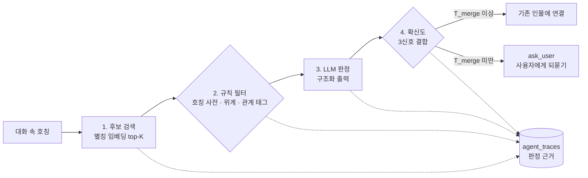

# 관계 메모리 에이전트 — 대화 속 호칭을 같은 사람으로 묶는 엔티티 해석과 평가 장치

[](https://github.com/SunWoo1213/Relationship/actions/workflows/tests.yml)

> "팀장 → 김팀장 → 부장님"처럼 바뀌는 호칭을 한 인물로 묶고, 확신이 모자라면 자동으로 합치지 않고 사용자에게 되묻는 관계 메모리 에이전트의 핵심 파이프라인입니다.

## 1. 프로젝트 개요

| 항목 | 내용 |
|---|---|
| 프로젝트명 | 대화형 관계 메모리 에이전트 (캡스톤디자인 2) |
| 개발 기간 | 2026.09 ~ 진행 중 |
| 참여 인원 | 1인 |
| 나의 역할<br>&nbsp;&nbsp;&nbsp;&nbsp;&nbsp;&nbsp;&nbsp;&nbsp;&nbsp;&nbsp;&nbsp;&nbsp;&nbsp;&nbsp;&nbsp;&nbsp;&nbsp;&nbsp;&nbsp; | 전체 — 스키마 v2(9테이블 · pgvector), 툴 7종, 엔티티 해석 4단계, 평가 장치. Claude Code 서브에이전트로 개발하고 계획 · 커밋 · 푸시는 단계마다 직접 승인 |

사용자가 평소처럼 대화하면 에이전트가 인물 · 사건 · 일정을 추출해 장기 메모리를 쌓고, 만남 직전에 필요한 맥락을 요약해 주는 것이 목표입니다. 한국어 대화는 같은 사람을 "팀장 → 김팀장 → 그 사람 → 부장님(승진 후)"처럼 부르기 때문에, 이 호칭들을 한 인물로 묶는 **엔티티 해석**이 전체 품질을 좌우합니다. 지금 저장소에는 엔티티 해석 파이프라인과 그 성능을 재는 평가 장치에 더해, 발화 한 건을 받아 인식 · 해석 · 기록 · 응답을 한 턴으로 돌리고(`POST /chat`) 되묻기를 비동기로 재개하는(`POST /answers/{question_id}`) 에이전트 루프까지 있습니다. 브리핑 · 화면 · 배포는 아직 없습니다.

## 2. 기술 스택

| 구분 | 기술 |
|---|---|
| 사용 언어 | Python 3.13 |
| 프레임워크 | FastAPI, SQLAlchemy 2.0, Alembic |
| 데이터베이스 | PostgreSQL 16 + pgvector (별칭 임베딩 `vector(1536)`, 별도 벡터 DB 없음) |
| AI<br>&nbsp;&nbsp;&nbsp;&nbsp;&nbsp;&nbsp;&nbsp;&nbsp;&nbsp;&nbsp;&nbsp;&nbsp;&nbsp;&nbsp;&nbsp;&nbsp;&nbsp;&nbsp;&nbsp;&nbsp;&nbsp;&nbsp;&nbsp; | OpenAI `gpt-4o-mini`(판정) · `text-embedding-3-small`(임베딩). 판정기는 `anthropic` · `openai` · `gemini` 등록표에서 고르며 기본값은 `openai` |
| 개발 도구 | pytest, GitHub Actions, Docker Compose, Claude Code(서브에이전트 · 훅) |

## 3. 시스템 구조



잘못 합치면(오병합) 사용자의 신뢰가 바로 무너지고, 못 묶으면(미검출) 메모리가 흩어질 뿐입니다. 그래서 오병합이 미검출보다 나쁘다는 전제로, LLM 한 번에 맡기지 않고 단계를 나눠 기준에 못 미치면 묻게 했습니다.

데이터 모델: `persons` · `person_aliases`(별칭 단위 임베딩) · `person_facts` · `fact_sources` · `events` · `schedules` · `pending_questions` · `push_subscriptions` · `agent_traces`.

## 4. 주요 기능

### 핵심 기능

- **엔티티 해석 4단계**(`app/er/`): 후보 검색 → 규칙 필터 → LLM 판정 → 확신도 분기. 확신도가 기준 미만이면 `identity`("김팀장님 말씀이신가요?") 또는 `new_person` 질문을 남깁니다.
- **툴 7종**(`app/tools/`): `search_person` · `create_person` · `update_person` · `add_event` · `add_schedule` · `get_briefing` · `ask_user`. 새 인물 생성은 사용자가 긍정 선택지로 답했을 때만 허용합니다.
- **에이전트 루프**(`app/agent/`): 발화 → LLM 1회로 `tool_calls`를 제안받고, 코드가 화이트리스트 · 인자 스키마 · `person_id` 직접 지정 금지로 거른 뒤(게이트) 엔티티 해석을 거쳐 실행합니다. 되묻기로 끝난 턴은 `pending_questions.context`에 남아 `POST /answers/{question_id}` 한 번으로 이어집니다.
- **평가 장치**(`evaluation/`): 제안 방식과 베이스라인 4종(완전일치 2 · 임베딩 단독 · LLM 단일 호출)을 같은 함수 · 같은 인자로 호출하고, 시나리오 40건(`data/scenarios/`)으로 같은 지표를 잽니다.

### 기술적 차별점

- **확신도 3신호 결합**: `confidence = 0.5·s_llm + 0.3·s_emb + 0.2·s_rule`. LLM 로그 확률 대신 구조화 출력의 자기보고 점수를 쓰고, 규칙을 재지 못했으면 그 신호를 분모에서 뺍니다.
- **임계치 2개**: `T_merge`(0.8) 이상만 자동 연결하고, `T_new`(0.3) 미만은 새 인물 질문, 그 사이는 동일 인물 확인 질문입니다.
- **`ask_user`를 별도 툴로**: "모른다"를 에이전트가 스스로 고르는 행동으로 두고, 답이 오면 루프를 이어 가는 대기 질문으로 저장합니다.
- **모든 판정에 근거**: 후보 · 확신도 분해 · 툴 호출 · 토큰을 `agent_traces`에 한 행씩 남겨, 원시 판정 파일 하나로 지표를 다시 계산할 수 있습니다.

### 성능 — 파일럿 평가 (시나리오 40건, 채점 132 mention, `T_merge` 0.8)

| 방식 | 오병합 | 미검출 | 되묻기 | F1 |
|---|---|---|---|---|
| 제안 방식 (첫 실행 P4 → 재실행 P4b) | 1 → **0** | 1 → **0** | 79건 59.8% → **31건 23.5%** | 0.566 → **0.897** |
| 임베딩 단독 (두 실행 동일) | 0 | 1 | 31건 23.5% | 0.892 |

조건: OpenAI `gpt-4o-mini-2024-07-18` · `text-embedding-3-small` 실제 호출, 5방식 × 임계치 10점 = 7,050행, 실행당 약 $0.027. 완전일치 2종 · 임베딩 단독의 판정은 두 실행에서 한 건도 바뀌지 않았고, LLM 단일 호출은 미검출 10 → 9로 바뀌었습니다. 40건 · 1회 실행이고, 두 실행 사이 136 mention 중 60건에서 LLM 자기보고 점수가 달라 개선 폭을 수정 효과만으로 나눌 수는 없습니다. 전후 비교는 [`reports/failure_cases.md`](reports/failure_cases.md) §13에 있습니다.

## 5. 문제 해결 사례

### 평가 — 제안 방식이 임베딩 단독 방식에 밀리던 문제

**직면한 문제**
첫 파일럿 평가에서 제안 방식은 오병합 1 · 미검출 1 · 되묻기 59.8%였고, 임베딩 단독 방식이 모든 축에서 같거나 나아 게이트를 통과하지 못했습니다. 실패 케이스를 단계별로 추적하니, 규칙을 하나도 재지 못한 호칭은 `s_rule`이 0으로 더해져 확신도가 0.80을 넘지 못했고, 규칙 필터가 정답 후보까지 빼 버린 경우도 있었습니다.

**해결 과정**
게이트 판정식은 바꾸지 않고 원인 두 가지만 고쳤습니다. 규칙을 재지 못했으면 `(0.5·s_llm + 0.3·s_emb) / 0.8`로 다시 정규화하고, 관계 태그 · 위계 충돌은 후보를 빼지 않고 감점만 하게 했습니다. 그 뒤 같은 40건을 한 번만 다시 실행했습니다.

**결과 및 학습점**
오병합 0 · 미검출 0, F1 0.897로 게이트를 통과했습니다. 임베딩 단독과는 되묻기가 같고 미검출 1건 차이입니다. 기준에 못 미쳤을 때 기준을 고치지 않고 실패 케이스를 먼저 분석한 것이 원인을 찾는 가장 빠른 길이었습니다.

핵심 코드: [`app/er/confidence.py`](app/er/confidence.py) · [`app/er/rules.py`](app/er/rules.py)

### DB — 툴 호출 기록 코드가 원래 DB 오류를 가리던 문제

**직면한 문제**
검증 단계에서 잘못된 크기(1535차원)의 임베딩을 넣어 보니, 호출자에게 원래 오류 `DataError` 대신 `PendingRollbackError`가 올라왔습니다. SQLAlchemy 2.0은 flush가 실패하면 세션을 "롤백 필요" 상태로 두는데, `@traced` 데코레이터가 같은 세션에 오류 기록을 다시 flush해 새 예외가 원래 예외를 덮었습니다.

**해결 과정**
오류 기록을 `session.begin_nested()`(SAVEPOINT) 안에서만 시도하고, 실패하면 기록을 포기한 뒤 원래 예외를 그대로 다시 던지게 했습니다. `session.rollback()`은 호출자가 아직 커밋하지 않은 정상 작업까지 지우므로 쓰지 않았습니다.

**결과 및 학습점**
호출자가 원래 `DataError`를 그대로 받고, 실제 PostgreSQL에서 이를 단언하는 재현 테스트를 추가했습니다(당시 전체 208 passed). 관측용 코드가 본래 동작을 바꾸면 안 된다는 것을 확인했습니다.

핵심 코드: [`app/tools/context.py`](app/tools/context.py)

### 개발 방식 — AI 코딩 에이전트가 자기 결과를 후하게 검토하던 문제

**직면한 문제**
첫 작업 단위에서 한 컨텍스트 · 한 모델이 계획을 쓰고, 같은 자리에서 점검표 8행을 "통과"로 채우고, 리뷰까지 썼습니다. 판정을 쓴 쪽이 만든 쪽과 같아 자기 계획의 전제를 의심하지 않았습니다.

**해결 과정**
계획(architect · Opus), 구현(backend-agent · Sonnet), 평가 데이터(eval-agent · Opus), 검증(verifier · Fable, 항상 새 컨텍스트)으로 역할과 모델을 나눴습니다. 검증 문서에 verifier가 없으면 검증 스크립트가 실패하게 했습니다.

**결과 및 학습점**
verifier가 실제 결함 3건을 찾았고, 소견 번호로 추적해 수정 · 재검증했습니다. 원래 DB 오류가 가려지는 문제(위 사례), DB 접속 정보 `repr`에 비밀번호가 찍히는 문제, "아니요"로 답해도 새 인물이 만들어지는 문제입니다.

근거: [`docs/wiki/lessons/L-002-role-model-separation.md`](docs/wiki/lessons/L-002-role-model-separation.md)

## 6. 테스트와 품질

- **pytest 918 passed**. LLM · 임베딩은 스텁으로 바꾸고, 판정 로직 · 경계값 · DB 제약은 실제 PostgreSQL + pgvector에서 검사합니다.
- **CI**(`.github/workflows/tests.yml`): `pgvector/pgvector:pg16` 서비스 컨테이너로 전체 테스트를 돌리고, 건너뛴 테스트가 하나라도 있으면 실패로 처리합니다.
- **실제 LLM 호출**은 파일럿 평가(P4 · P4b)와 OpenAI 스모크 2건(`er_smoke.py` · `baseline_smoke.py`)에서 확인했습니다.
- 계획 · 구현마다 verifier가 새 컨텍스트에서 증거(명령 출력 · 커밋 해시)로 검토하고, 지적은 소견 번호(`F-xxxxxx`)로 남겨 재검증까지 추적합니다.

## 7. 개발 방식

Claude Code로 개발하며, 에이전트가 기획서 의도에서 벗어나지 않도록 절차를 훅으로 강제합니다. 기획서를 먼저 검증해 문제(R) → 결정(D) → 명세(S) → 작업 패키지(P) → 커밋으로 이어 붙였기 때문에, 커밋마다 왜 생겼는지 거꾸로 추적할 수 있습니다.

- **역할 분리와 승인 게이트**: 계획 · 구현 · 검증을 다른 모델이 맡고, 계획 · 커밋 · 푸시 · main 승격은 사람이 승인합니다.
- **훅 10개**(`.claude/hooks/`): 승인 없는 커밋 · 푸시, `.env` · 키 파일 쓰기, 강제 푸시 · 이력 파괴, 승인 없는 에이전트 위임을 막고, 인수인계 문서(`HANDOFF.md`)가 코드보다 오래되면 세션 종료를 막습니다.
- **git pre-commit**(`.githooks/`): 비밀 파일 · 비밀 문자열 · 5MB 초과 파일 커밋을 git 자체가 막습니다.

절차와 교훈은 [`docs/wiki/INDEX.md`](docs/wiki/INDEX.md) · [`docs/wiki/lessons/`](docs/wiki/lessons/)에 있습니다.

## 8. 실행 방법

```bash
# 1. 환경변수 — 키 이름만 적힌 .env.example 을 복사해 값을 채웁니다 (.env 는 git 제외)
cp .env.example .env

# 2. 의존성 (Python 3.13)
pip install -r requirements-dev.txt

# 3. 로컬 DB (PostgreSQL 16 + pgvector) 와 스키마
docker compose up -d
python -m alembic upgrade head

# 4. 테스트 (네트워크 불필요 — LLM · 임베딩은 스텁)
python -m pytest -q tests/
```

로컬 포트 설정, 백엔드 실행, 엔티티 해석 · 베이스라인 · 파일럿 평가 재현 방법은 [`docs/RUNNING.md`](docs/RUNNING.md)에 있습니다.

## 9. 문서 · License

| 알고 싶은 것 | 보는 곳 |
|---|---|
| 왜 이렇게 설계했나 | `docs/wiki/decisions/` |
| 스키마 · 툴 · 해석 파이프라인 · 평가 명세 | `docs/wiki/specs/` |
| 평가 결과 · 실패 케이스 분석<br>&nbsp;&nbsp;&nbsp;&nbsp;&nbsp;&nbsp;&nbsp;&nbsp;&nbsp;&nbsp;&nbsp;&nbsp;&nbsp;&nbsp;&nbsp;&nbsp;&nbsp;&nbsp;&nbsp;&nbsp;&nbsp;&nbsp;&nbsp;&nbsp;&nbsp;&nbsp;&nbsp;&nbsp;&nbsp;&nbsp;&nbsp;&nbsp; | `reports/eval.md` · `reports/failure_cases.md` · `reports/metrics.json` |
| 평가 데이터셋 | `data/scenarios/` (라벨 규칙 `schema.json`) |
| 프로젝트 규칙 | `CLAUDE.md` |

MIT — [LICENSE](LICENSE)
