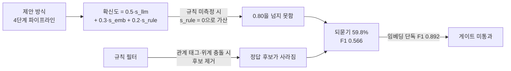
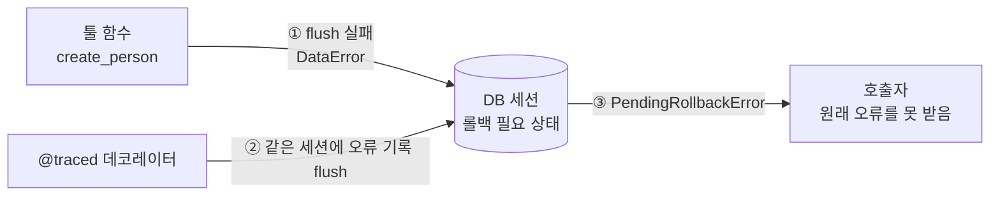
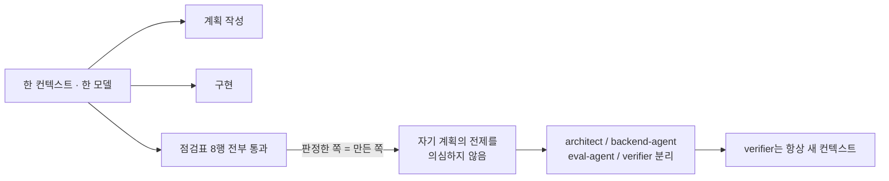

# 관계 메모리 에이전트

대화에서 바뀌는 호칭을 같은 사람으로 묶고, 확신이 모자라면 자동으로 합치지 않고 사용자에게 되묻는 에이전트입니다.

[](https://github.com/SunWoo1213/Relationship/actions/workflows/tests.yml)

## 프로젝트 목적

사용자가 평소처럼 대화하면 에이전트가 인물과 사건, 일정을 뽑아 장기 메모리를 쌓고, 만남 직전에 필요한 맥락을 요약해 주는 것이 목표입니다.

한국어 대화는 같은 사람을 "팀장 → 김팀장 → 그 사람 → 부장님(승진 후)"처럼 부릅니다. 이 호칭들을 한 인물로 묶는 엔티티 해석이 전체 품질을 좌우합니다. 여기서 두 종류의 실패는 무게가 다릅니다. 잘못 합치면 사용자가 보는 메모리가 오염돼 신뢰가 바로 무너지고, 못 묶으면 메모리가 흩어질 뿐입니다. 그래서 오병합이 미검출보다 나쁘다는 전제로 설계했고, LLM 한 번에 맡기지 않고 단계를 나눠 기준에 못 미치면 묻게 했습니다.

"묻는다"를 예외 처리가 아니라 에이전트가 고를 수 있는 행동으로 두는 것이 이 프로젝트의 중심입니다. `ask_user`를 별도 툴로 만들고, 되묻기로 끝난 턴은 대기 질문으로 저장해 답이 오면 이어서 재개합니다.

2026년 9월부터 진행 중인 캡스톤디자인 2 프로젝트이고 1인으로 개발하고 있습니다.

| 단계 | 내용 | 상태 |
| --- | --- | --- |
| P1 ~ P3 | 스키마, 툴 7종, 엔티티 해석 4단계, 베이스라인, 파일럿 데이터셋 | 완료 |
| P4 · P4b | 파일럿 평가 → 실패 분석 → 확신도 재설계 후 게이트 통과 | 완료 |
| P5 | 에이전트 루프(`POST /chat`)와 되묻기 재개(`POST /answers/{id}`) | 완료, 실제 LLM 연결 왕복 확인은 남음 |
| P6 이후 | 메모리 승격, 반복 패턴 감지, 브리핑, 화면, 배포 | 예정 |

## 사용 기술 스택

| 구분 | 기술 | 선택한 이유 |
| --- | --- | --- |
| 언어 | Python 3.13 | |
| 프레임워크 | FastAPI, SQLAlchemy 2.0, Alembic | |
| 데이터베이스 | PostgreSQL 16 + pgvector | 별칭 임베딩과 관계 데이터를 한 트랜잭션에서 다루려고 별도 벡터 DB를 두지 않았습니다 |
| 임베딩 | OpenAI `text-embedding-3-small` (1536차원) | 후보 공급자를 실측 비교해 인덱스 차원 한도와 오병합 회피를 기준으로 골랐습니다 |
| 판정 | OpenAI `gpt-4o-mini` | 판정기는 `anthropic` · `openai` · `gemini` 등록표에서 교체할 수 있게 하고 기본값만 지정했습니다 |
| 테스트 · CI | pytest, GitHub Actions, Docker Compose | 판정 로직과 DB 제약은 스텁이 아니라 실제 PostgreSQL에서 검사해야 했습니다 |
| 개발 도구 | Claude Code (서브에이전트 · 훅 10개) | |

## 아키텍처 구조


```mermaid
flowchart LR
    U([사용자 발화]) --> L[LLM 1회<br/>tool_calls 제안]
    L --> GATE{코드 게이트<br/>화이트리스트 · 인자 스키마<br/>person_id 직접 지정 금지}
    GATE --> ER[엔티티 해석 4단계]
    ER --> T1[1. 후보 검색<br/>별칭 임베딩 top-K]
    T1 --> T2{2. 규칙 필터<br/>호칭 사전 · 위계 · 관계 태그}
    T2 --> T3[3. LLM 판정<br/>구조화 출력]
    T3 --> T4{4. 확신도 3신호 결합}
    T4 -->|T_merge 0.8 이상| MERGE[기존 인물에 연결]
    T4 -->|0.3 ~ 0.8| ASK[동일 인물 확인 질문]
    T4 -->|T_new 0.3 미만| NEW[새 인물 질문]
    ASK & NEW --> PQ[(pending_questions<br/>답이 오면 루프 재개)]
    T1 & T2 & T3 & T4 -.-> TR[(agent_traces<br/>판정 근거 한 행씩)]
```

확신도는 `0.5·s_llm + 0.3·s_emb + 0.2·s_rule`로 계산합니다. LLM의 로그 확률은 API에서 받을 수 없어 구조화 출력의 자기보고 점수를 쓰고, 규칙을 하나도 재지 못한 경우에는 그 신호를 분모에서 뺍니다.

데이터 모델은 `persons`, `person_aliases`(별칭 단위 임베딩), `person_facts`, `fact_sources`, `events`, `schedules`, `pending_questions`, `push_subscriptions`, `agent_traces` 9개 테이블입니다.

## 역할과 기여도

1인 프로젝트로 설계와 구현, 평가를 모두 직접 했습니다. Claude Code 서브에이전트로 개발하되 계획과 커밋, 푸시는 단계마다 직접 승인했습니다.

- 스키마 9테이블을 설계하고 별칭 단위 임베딩을 pgvector로 저장하게 했습니다.
- 툴 7종을 만들었습니다. `search_person`, `create_person`, `update_person`, `add_event`, `add_schedule`, `get_briefing`, `ask_user`이고, 새 인물 생성은 사용자가 긍정 선택지로 답했을 때만 허용합니다.
- 엔티티 해석 4단계와 확신도 결합식, 임계치 2개를 설계하고 구현했습니다.
- 에이전트 루프를 만들었습니다. LLM이 제안한 툴 호출을 코드가 걸러 실행하고, 되묻기로 끝난 턴을 비동기로 재개합니다.
- 평가 장치를 만들었습니다. 제안 방식과 베이스라인 4종을 같은 함수 · 같은 인자로 호출해 시나리오 40건에 같은 지표를 적용합니다.
- 모든 판정의 후보와 확신도 분해, 툴 호출, 토큰을 `agent_traces`에 남겨 원시 판정 파일 하나로 지표를 다시 계산할 수 있게 했습니다.
- 승인 없는 커밋 · 푸시, 비밀 파일 쓰기, 강제 푸시를 막는 훅 10개와 git pre-commit 훅을 두었습니다.

## 트러블슈팅 해결 과정

### 제안 방식이 단순 베이스라인에 밀리던 문제를 실패 분석으로 원인을 찾아 해결

**문제 흐름**


```mermaid
flowchart LR
  P[제안 방식<br/>4단계 파이프라인] --> C["확신도 = 0.5·s_llm<br/>+ 0.3·s_emb + 0.2·s_rule"]
  C -->|규칙 미측정 시<br/>s_rule = 0으로 가산| L[0.80을 넘지 못함]
  R[규칙 필터] -->|관계 태그·위계 충돌 시<br/>후보 제거| D[정답 후보가 사라짐]
  L & D --> F[되묻기 59.8%<br/>F1 0.566]
  F -->|임베딩 단독 F1 0.892| G[게이트 미통과]
```

**문제 원인**

- 첫 파일럿 평가에서 제안 방식은 오병합 1, 미검출 1, 되묻기 59.8%, F1 0.566이었고, 임베딩 단독 베이스라인이 모든 축에서 같거나 나아 게이트를 통과하지 못했음
- 실패 케이스를 단계별로 추적한 결과 원인이 둘이었음
- 원인 ① 규칙을 하나도 재지 못한 호칭은 `s_rule`이 0으로 더해져, 나머지 신호가 아무리 높아도 확신도가 `T_merge` 0.8을 넘지 못했음. 측정하지 못한 것을 0점으로 취급한 것이 문제였음
- 원인 ② 규칙 필터가 관계 태그와 위계 충돌을 만나면 후보를 아예 제거해, 정답 후보까지 빼 버리는 경우가 있었음

**해결 과정**

- 게이트 판정식과 임계치는 바꾸지 않고 원인 두 가지만 고침. 기준에 못 미쳤다고 기준을 낮추면 평가가 의미를 잃음
- 규칙을 재지 못했으면 `(0.5·s_llm + 0.3·s_emb) / 0.8`로 다시 정규화해, 없는 신호가 감점으로 작동하지 않게 함
- 관계 태그와 위계 충돌은 후보를 제거하지 않고 감점만 하도록 바꿈
- 같은 시나리오 40건을 조건을 바꾸지 않고 한 번 다시 실행함

**테스트**

- 환경: OpenAI `gpt-4o-mini-2024-07-18`와 `text-embedding-3-small` 실제 호출, 5방식 × 임계치 10점 = 7,050행, 실행당 약 $0.027
- 제안 방식과 베이스라인 4종(완전일치 2종, 임베딩 단독, LLM 단일 호출)을 같은 함수 · 같은 인자로 호출해 같은 지표를 적용
- 한계를 함께 기록함. 40건 1회 실행이고, 두 실행 사이 136 mention 중 60건에서 LLM 자기보고 점수가 달라져 개선 폭을 수정 효과만으로 나눌 수 없음

**결과** 오병합 0, 미검출 0, 되묻기 23.5%, F1 0.897로 게이트를 통과. 임베딩 단독과는 되묻기가 같고 미검출 1건 차이

**배운 점** 기준에 못 미쳤을 때 기준을 고치지 않고 실패 케이스를 먼저 분석하는 것이 원인을 찾는 가장 빠른 길이며, 측정하지 못한 신호를 0점으로 더하면 안 됨

### 툴 호출 기록 코드가 원래 DB 오류를 가리던 문제를 SAVEPOINT로 격리해 해결

**문제 흐름**


```mermaid
flowchart LR
  T[툴 함수<br/>create_person] -->|① flush 실패<br/>DataError| S[(DB 세션<br/>롤백 필요 상태)]
  D["@traced 데코레이터"] -->|② 같은 세션에 오류 기록 flush| S
  S -->|③ PendingRollbackError| C[호출자<br/>원래 오류를 못 받음]
```

**문제 원인**

- 배경: 에이전트의 모든 툴 호출은 `@traced` 데코레이터가 `agent_traces` 테이블에 기록하고, 실패하면 오류도 기록함
- 검증 단계에서 일부러 잘못된 크기(1535차원)의 임베딩을 넣어 보니, 호출자에게 원래 오류인 `DataError` 대신 `PendingRollbackError`가 전달되고 오류 기록도 남지 않았음
- SQLAlchemy 2.0은 flush가 실패하면 세션을 "롤백 필요" 상태로 두는데, 데코레이터가 같은 세션에서 오류 기록을 다시 flush하면서 새 예외가 원래 예외를 덮어씀

**해결 과정**

- 오류 기록은 `session.begin_nested()`(SAVEPOINT) 안에서만 시도하고, 실패하면 기록을 포기한 채 원래 예외를 그대로 다시 발생시킴
- `session.rollback()`은 호출자가 아직 커밋하지 않은 정상 작업까지 되돌리므로 사용하지 않음

**테스트**

- 환경: 로컬 Docker PostgreSQL 16 + pgvector, 실제 DB로 pytest 실행
- 수정 전: 확인용 스크립트로 호출자가 받는 예외가 `PendingRollbackError`(원인: `DataError: expected 1536 dimensions, not 1535`)임을 확인
- 수정 후: flush가 실패하면 호출자가 원래 오류를 받는지 검증하는 재현 테스트를 추가하고, 당시 전체 208개 테스트 통과

**결과** 호출자가 원래 `DataError`를 그대로 받게 됨

**배운 점** 관측을 위한 코드가 본래 동작을 바꾸면 안 됨

### AI 코딩 에이전트가 자기 결과를 후하게 검토하던 문제를 역할과 모델 분리로 해결

**문제 흐름**


```mermaid
flowchart LR
  A[한 컨텍스트 · 한 모델] --> P[계획 작성]
  A --> I[구현]
  A --> V["점검표 8행 전부 통과"]
  V -->|판정한 쪽 = 만든 쪽| B[자기 계획의 전제를<br/>의심하지 않음]
  B --> S[architect / backend-agent<br/>eval-agent / verifier 분리]
  S --> N[verifier는 항상 새 컨텍스트]
```

**문제 원인**

- 첫 작업 단위에서 한 컨텍스트, 한 모델이 계획을 쓰고 같은 자리에서 점검표 8행을 전부 "통과"로 채우고 리뷰까지 작성했음
- 판정을 쓴 쪽이 만든 쪽과 같아서 자기 계획의 전제를 의심하지 않았음. 통과 표시가 실제 검증이 아니라 자기 보고였음

**해결 과정**

- 역할과 모델을 나눔. 계획은 architect(Opus), 구현은 backend-agent(Sonnet), 평가 데이터는 eval-agent(Opus), 검증은 verifier(Fable)가 맡고 verifier는 항상 새 컨텍스트에서 시작함
- 검증 문서에 verifier의 기록이 없으면 검증 스크립트 자체가 실패하도록 해, 절차를 건너뛸 수 없게 만듦
- 지적은 소견 번호(`F-xxxxxx`)로 남겨 수정과 재검증까지 추적함

**테스트**

- 환경: 각 작업 단위의 검증 단계, verifier가 명령 출력과 커밋 해시를 증거로 제출
- 분리 이후 실제 결함 3건이 발견됨. 원래 DB 오류가 가려지던 문제(위 사례), DB 접속 정보 `repr`에 비밀번호가 찍히는 문제, "아니요"로 답해도 새 인물이 만들어지는 문제

**결과** 자기 검토로는 나오지 않던 결함 3건을 잡고, 소견 번호로 수정과 재검증까지 추적하게 됨

**배운 점** 만든 쪽과 판정하는 쪽이 같으면 검토가 아니라 자기 보고이며, 절차는 문서가 아니라 실패하는 스크립트로 강제해야 지켜짐

## 결과

진행 중인 프로젝트입니다. 화면과 배포는 아직 없습니다.

**파일럿 평가** 시나리오 40건, 채점 132 mention, `T_merge` 0.8

| 방식 | 오병합 | 미검출 | 되묻기 | F1 |
| --- | --- | --- | --- | --- |
| 제안 방식 (첫 실행 P4 → 재실행 P4b) | 1 → 0 | 1 → 0 | 79건 59.8% → 31건 23.5% | 0.566 → 0.897 |
| 임베딩 단독 (두 실행 동일) | 0 | 1 | 31건 23.5% | 0.892 |

완전일치 2종과 임베딩 단독의 판정은 두 실행에서 한 건도 바뀌지 않았고, LLM 단일 호출은 미검출 10에서 9로 바뀌었습니다. 전후 비교는 [`reports/failure_cases.md`](reports/failure_cases.md) §13에 있습니다.

**테스트** pytest 1,474개 통과, 건너뜀 0. LLM과 임베딩은 스텁으로 바꾸고, 판정 로직과 경계값, DB 제약은 실제 PostgreSQL + pgvector에서 검사합니다. CI는 `pgvector/pgvector:pg16` 서비스 컨테이너로 전체를 돌리고 건너뛴 테스트가 하나라도 있으면 실패로 처리합니다.

**아직 확인하지 않은 것** 실제 LLM 호출은 파일럿 평가와 OpenAI 스모크 2건에서 확인했습니다. 에이전트 루프는 스텁 LLM으로 요청 한 건 안의 저장, 응답, 재개까지 검사했고 실제 공급자로 서버를 띄운 왕복은 아직 확인하지 않았습니다.

## 개발 방식

Claude Code로 개발하며, 에이전트가 기획서 의도에서 벗어나지 않도록 절차를 훅으로 강제합니다. 기획서를 먼저 검증해 문제(R) → 결정(D) → 명세(S) → 작업 패키지(P) → 커밋으로 이어 붙였기 때문에, 커밋마다 왜 생겼는지 거꾸로 추적할 수 있습니다.

- 계획과 구현, 검증을 다른 모델이 맡고 계획 · 커밋 · 푸시 · main 승격은 사람이 승인합니다.
- 훅 10개가 승인 없는 커밋과 푸시, `.env`와 키 파일 쓰기, 강제 푸시와 이력 파괴, 승인 없는 에이전트 위임을 막고, 인수인계 문서가 코드보다 오래되면 세션 종료를 막습니다.
- git pre-commit 훅이 비밀 파일과 비밀 문자열, 5MB 초과 파일의 커밋을 git 단계에서 막습니다.

## 실행 방법

```bash
cp .env.example .env          # 키 이름만 적힌 템플릿, .env 는 git 제외
pip install -r requirements-dev.txt

docker compose up -d          # PostgreSQL 16 + pgvector
python -m alembic upgrade head

python -m pytest -q tests/    # 네트워크 불필요, LLM · 임베딩은 스텁
```

테스트는 `relationship_test` DB를 씁니다. 없으면 pytest가 스스로 만들고 마이그레이션합니다. 백엔드 실행, 채팅 API 호출, 평가 재현 방법은 [`docs/RUNNING.md`](docs/RUNNING.md)에 있습니다.

## 문서

| 알고 싶은 것 | 보는 곳 |
| --- | --- |
| 왜 이렇게 설계했나 | `docs/wiki/decisions/` |
| 스키마 · 툴 · 해석 파이프라인 · 평가 명세 | `docs/wiki/specs/` |
| 평가 결과 · 실패 케이스 분석 | `reports/eval.md` · `reports/failure_cases.md` · `reports/metrics.json` |
| 평가 데이터셋 | `data/scenarios/` (라벨 규칙 `schema.json`) |
| 절차와 교훈 | `docs/wiki/INDEX.md` · `docs/wiki/lessons/` |

MIT — [LICENSE](LICENSE)
