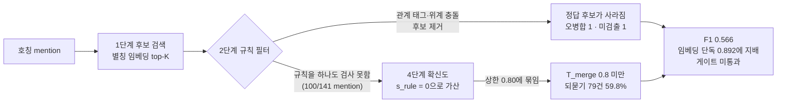
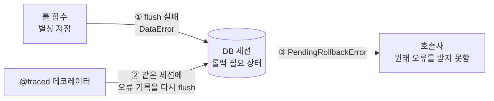
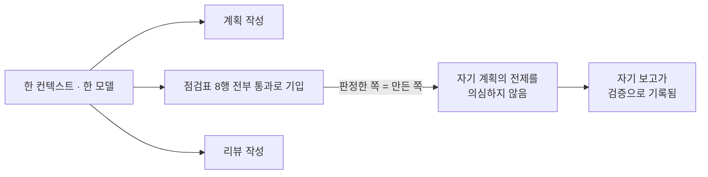
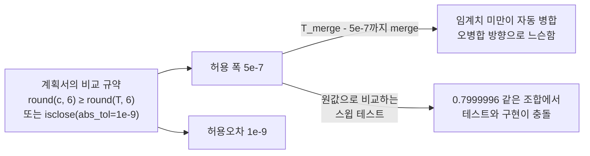
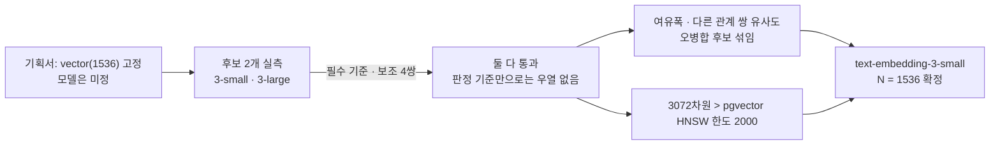
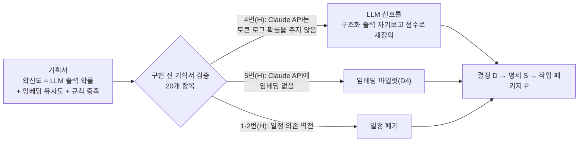
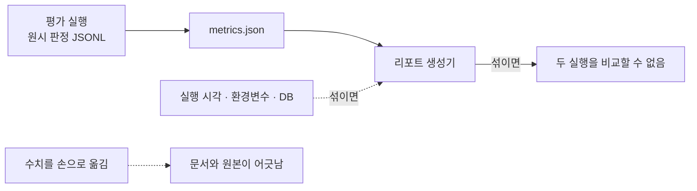
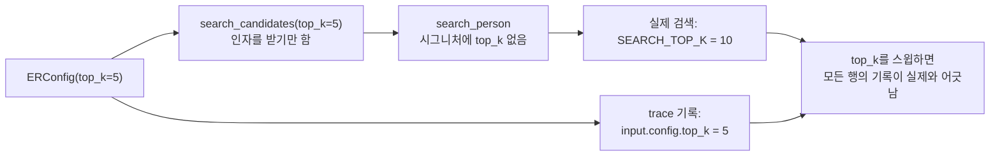

# 관계 메모리 에이전트

대화에서 바뀌는 호칭을 같은 사람으로 묶고, 확신이 모자라면 자동으로 합치지 않고 사용자에게 되묻는 에이전트입니다.

[](https://github.com/SunWoo1213/Relationship/actions/workflows/tests.yml)

## 개요

| 항목 | 내용 |
| --- | --- |
| 기간 | 2026.09 ~ 진행 중 (캡스톤디자인 2) |
| 인원과 역할 | 1인 개발. 설계, 구현, 평가를 모두 맡음 |
| 상태 | 진행 중. 엔티티 해석과 파일럿 평가, 에이전트 루프까지 구현했고 화면과 배포는 아직 없음 |
| 핵심 기술 | Python 3.13 · FastAPI · PostgreSQL 16 + pgvector · OpenAI 임베딩과 구조화 출력 · pytest + GitHub Actions |

사용자가 평소처럼 대화하면 에이전트가 인물과 사건, 일정을 뽑아 장기 메모리를 쌓고, 만남 직전에 필요한 맥락을 요약해 주는 것이 목표입니다.

한국어 대화는 같은 사람을 "팀장 → 김팀장 → 그 사람 → 부장님(승진 후)"처럼 부릅니다. 이 호칭들을 한 인물로 묶는 엔티티 해석이 전체 품질을 좌우합니다. 여기서 두 종류의 실패는 무게가 다릅니다. 잘못 합치면(오병합) 사용자가 보는 메모리가 오염돼 신뢰가 바로 무너지고, 못 묶으면(미검출) 메모리가 흩어질 뿐입니다. 그래서 **오병합이 미검출보다 나쁘다**는 전제로 설계했고, LLM 한 번에 맡기지 않고 단계를 나눠 기준에 못 미치면 묻게 했습니다.

이 프로젝트는 "묻는다"를 예외 처리로 두지 않고 에이전트가 고를 수 있는 행동으로 둡니다. `ask_user`를 별도 툴로 만들고, 되묻기로 끝난 턴은 대기 질문으로 저장해 답이 오면 이어서 재개합니다.

| 단계 | 내용 | 상태 |
| --- | --- | --- |
| P1 ~ P3 | 스키마, 툴 7종, 엔티티 해석 4단계, 베이스라인, 파일럿 데이터셋 | 완료 |
| P4 · P4b | 파일럿 평가 → 실패 분석 → 확신도 재설계 후 게이트 통과 | 완료 |
| P5 | 에이전트 루프(`POST /chat`)와 되묻기 재개(`POST /answers/{id}`) | 완료, 실제 LLM 연결 왕복 확인은 남음 |
| P6 이후 | 메모리 승격, 반복 패턴 감지, 브리핑, 화면, 배포 | 예정 |

## 문제 해결 사례

1. [실패 케이스 분석으로 확신도 결합식을 고쳐 단순 베이스라인에 밀리던 문제 해결](#실패-케이스-분석으로-확신도-결합식을-고쳐-단순-베이스라인에-밀리던-문제-해결)
2. [툴 호출 기록 코드가 원래 DB 오류를 가리던 문제를 SAVEPOINT로 격리해 해결](#툴-호출-기록-코드가-원래-db-오류를-가리던-문제를-savepoint로-격리해-해결)
3. [AI 코딩 에이전트의 후한 자기 검토를 역할과 모델 분리로 해결](#ai-코딩-에이전트의-후한-자기-검토를-역할과-모델-분리로-해결)
4. [두 갈래로 적힌 부동소수점 허용오차를 하나로 모아 오병합 쪽 누수를 막음](#두-갈래로-적힌-부동소수점-허용오차를-하나로-모아-오병합-쪽-누수를-막음)
5. [임베딩 모델과 차원을 인덱스 한도와 오병합 위험 기준으로 실측해 결정](#임베딩-모델과-차원을-인덱스-한도와-오병합-위험-기준으로-실측해-결정)
6. [구현 전에 기획서를 검증해 API에서 얻을 수 없는 LLM 출력 확률 전제를 바로잡음](#구현-전에-기획서를-검증해-api에서-얻을-수-없는-llm-출력-확률-전제를-바로잡음)
7. [같은 입력이면 같은 바이트가 나오는 평가 리포트 생성기](#같은-입력이면-같은-바이트가-나오는-평가-리포트-생성기)
8. [동작에 반영되지 않는 top_k 설정이 기록에만 남는 문제를 평가 산출물에 명시](#동작에-반영되지-않는-top_k-설정이-기록에만-남는-문제를-평가-산출물에-명시)

### 실패 케이스 분석으로 확신도 결합식을 고쳐 단순 베이스라인에 밀리던 문제 해결

**문제 흐름**


```mermaid
flowchart LR
  M["호칭 mention"] --> S1["1단계 후보 검색<br/>별칭 임베딩 top-K"]
  S1 --> S2{"2단계 규칙 필터"}
  S2 -->|"관계 태그·위계 충돌<br/>후보 제거"| X["정답 후보가 사라짐<br/>오병합 1 · 미검출 1"]
  S2 -->|"규칙을 하나도 검사 못함<br/>(100/141 mention)"| S4["4단계 확신도<br/>s_rule = 0으로 가산"]
  S4 -->|"상한 0.80에 묶임"| D["T_merge 0.8 미만<br/>되묻기 79건 59.8%"]
  X & D --> G["F1 0.566<br/>임베딩 단독 0.892에 지배<br/>게이트 미통과"]
```

**문제 원인**

엔티티 해석은 4단계로 동작합니다. 1단계가 별칭 임베딩으로 후보를 찾고, 2단계 규칙 필터가 호칭 사전·위계·관계 태그로 후보를 거르고, 3단계 LLM이 구조화 출력으로 후보 중 한 명을 고르며 자기보고 점수 `s_llm`을 냅니다. 4단계는 `confidence = 0.5·s_llm + 0.3·s_emb + 0.2·s_rule`로 확신도를 계산해 `T_merge`(0.8) 이상이면 병합하고, `T_new`(0.3) 미만이면 새 인물로 보고, 그 사이면 사용자에게 묻습니다.

이 방식이 단순한 방법보다 나은지를 보려고 평가 게이트를 미리 정했습니다. 제안 방식과 베이스라인 4종(완전일치 2종, 임베딩 단독, LLM 단일 호출)을 같은 함수 · 같은 인자로 호출해 시나리오 40건(전체 141 mention 중 채점 대상 132건)에 같은 지표를 적용합니다. 비교 축은 `T_merge` 0.8에서의 오병합률과 미검출률입니다. 두 축 모두 제안 방식과 같거나 낮고 한 축 이상에서 더 낮은 베이스라인이 하나라도 있으면, 제안 방식이 그 베이스라인에 지배당한 것으로 보고 게이트를 통과시키지 않습니다. `T_merge`를 올릴수록 오병합이 늘지 않아야 한다는 방향 조건도 함께 봅니다.

첫 실행 결과는 다음과 같았습니다.

| 방식 | 정답 병합 | 오병합 | 미검출 | 되묻기(identity) | F1 |
| --- | --- | --- | --- | --- | --- |
| 제안 방식 | 47 | 1 | 1 | 79 (59.8%) | 0.566 |
| 임베딩 단독 | 95 | 0 | 1 | 31 (23.5%) | 0.892 |
| LLM 단일 호출 | 90 | 0 | 10 | 19 (14.4%) | 0.865 |

임베딩 단독이 오병합 0 · 미검출 1로 두 축 모두에서 같거나 나았고, 제안 방식은 게이트를 통과하지 못했습니다. 4단계 파이프라인이 임베딩 유사도 하나만 보는 방법보다 못한 상태였습니다. 판정식이나 데이터셋을 손대지 않고, 원시 판정 7,050행과 판정 근거 trace를 단계별로 추적했습니다. 확인한 가설은 다음 순서입니다.

- **LLM 판정이 부정확하거나 과신하는가 → 반증.** 임계치와 무관하게 LLM이 고른 인물만 보면 `s_llm` 0.9 이상 구간에서 98/101(97.0%)이 정답이었습니다. 보정표에서 같은 구간이 47/101(46.5%)로 낮게 보인 것은, 되묻기로 끝난 건을 오답으로 세는 정의 때문이었습니다.
- **후보 검색이 정답을 놓치는가 → 반증.** 되묻기 79건 중 정답이 DB 안 인물인 69건 모두에서 정답이 후보 목록에 있었습니다.
- **임계치가 너무 높은가 → 임계치만으로는 풀리지 않음.** `T_merge` 격자 10점을 보면 0.75로 내리면 되묻기는 33건으로 줄지만 오병합이 2건으로 늘고 여전히 지배당했습니다. 지배가 풀리는 점은 0.50 하나였는데, 거기서는 오병합이 6/132로 같은 0.50에서의 임베딩 단독과 동률이 됐을 뿐입니다.
- **되묻기 79건이 어디서 왔는가 → 원인 ①.** 79건 중 52건이 0.7~0.8 구간에 몰려 있었고, 그중 0.75라는 값이 29번 나왔습니다. 72건에서 `s_rule`이 0이었습니다. 규칙을 하나도 검사하지 못한 mention(`rule_checked = 0`)이 141건 중 100건이었고, 발화에서 위계·관계 힌트를 하나도 뽑지 못한 mention은 91건이었습니다. 규칙을 검사하지 못한 경우에도 `s_rule`이 0점으로 더해졌습니다. 그러면 확신도 상한이 `0.5·1.0 + 0.3·1.0 = 0.80`이 됩니다. LLM이 0.9를 주고 임베딩이 1.0이어도 0.75가 되어 자동으로 되묻기로 갑니다. 되묻기 79건 중 61건은 4단계가 고른 인물이 이미 정답이었습니다.
- **오병합 1건과 미검출 1건은 어디서 생겼나 → 원인 ②.** 둘 다 2단계가 정답 후보를 제거한 경우였습니다.
  - 오병합 `sc-015` "부장님": 발화는 "은우 별명이 부장님이야"였고 정답은 친구 조은우였습니다. 규칙 필터가 관계 태그 충돌로 조은우를 빼자 직장 상사 한지원만 남았고, 세 신호가 모두 한지원을 가리켜 `0.5·0.9 + 0.3·1.0 + 0.2·1.0 = 0.95`로 병합됐습니다. 같은 mention에서 나머지 베이스라인 4종은 모두 "모른다"고 답했습니다.
  - 미검출 `sc-007` "문실장님": 승진으로 호칭이 "문쌤"에서 바뀐 경우라 임베딩 유사도가 0.314였고, 규칙 필터가 남은 한 명마저 제거했습니다. 후보가 0명이 되자 LLM을 부르지 않고 확신도가 0.0으로 강제돼 "새 사람"으로 단정했습니다.

정리하면 제안 방식이 진 이유는 판정이 틀려서가 아니었습니다. 측정하지 못한 신호를 0점으로 더한 4단계의 결합식과, 자동 추론한 힌트 하나로 후보를 영구히 지운 2단계 때문이었습니다.

**해결 과정**

게이트 판정식, 임계치 두 개, 가중치 비율, 데이터셋은 그대로 두고 원인 두 가지만 고쳤습니다. 기준에 못 미쳤다고 기준을 바꾸면 평가가 의미를 잃기 때문입니다. 두 변경은 설계 결정 D12 · D13으로 남기고 변경 요청 CR-001로 관련 문서 다섯 곳을 함께 고쳤습니다.

- **D12 관측된 신호만 재정규화** (기존 결정 D3 대체): 규칙을 하나도 검사하지 못했으면 `s_rule`을 분모에서 뺍니다. 세 신호가 모두 관측되면 분모가 1.0이라 기존 식과 같은 값이 나옵니다.

  ```python
  # app/er/confidence.py — combine()
  if rule_checked > 0:
      return config.w_llm * s_llm + config.w_emb * s_emb_clamped + config.w_rule * s_rule
  denom = config.w_llm + config.w_emb
  return (config.w_llm * s_llm + config.w_emb * s_emb_clamped) / denom
  ```

  검사는 했지만 전부 충돌한 경우(`rule_checked > 0`, `rule_passed = 0`)는 측정된 0점이므로 재정규화하지 않습니다. trace에는 설정 가중치와 실제 적용된 `weights_effective`를 함께 남겨, 원시 파일만으로 확신도를 다시 계산할 수 있게 했습니다.
- **D13 배제 대신 감점**: 관계 태그·위계 충돌 후보를 목록에서 지우지 않고 `s_rule`에만 반영해 3단계 LLM이 후보 전체를 비교하게 했습니다. 호칭 사전 모순(`dictionary_conflict`)으로 인한 배제는 유지했습니다.
- **보수 분기 추가**: D13은 3단계로 가는 후보를 늘리므로 오병합 기회도 늘어납니다. 40건으로는 이 위험을 검증할 수 없어서, 감점된 후보가 선택되면 확신도가 `T_merge` 이상이어도 자동 병합하지 않고 되묻기로 내리도록 했습니다. 승진처럼 인접 위계 한 칸을 완화해 통과한 후보만 예외로 자동 병합을 허용합니다(`forced_reason = "penalized_candidate"`, 설정값 `ER_PENALIZED_MERGE_POLICY=ask`).

검토했지만 버린 대안은 두 가지입니다. `T_merge`를 낮추는 방법은 위 격자에서 보듯 가장 비싼 축인 오병합을 늘리면서도 지배를 풀지 못했습니다. 보정표를 근거로 `s_llm`을 보정하는 방법은, LLM 자기보고에서 과신의 증거가 나오지 않았으므로 하지 않았습니다.

재실행 전에 저장된 신호로 D12만 적용한 반사실 계산을 먼저 했습니다(병합 48 → 97건, 그중 정답 96건, 오병합 1건 유지 예측). 그다음 같은 40건을 조건을 바꾸지 않고 한 번만 다시 실행했습니다. 첫 실행의 분석 문서(§1~12)는 비교 기준선으로 남기고 한 글자도 고치지 않았습니다.

**테스트**

- 환경: OpenAI `gpt-4o-mini-2024-07-18`와 `text-embedding-3-small` 실제 호출. 5방식 × 임계치 10점 = 7,050행, 실행당 약 $0.027. 두 실행의 데이터셋 해시가 같음을 확인했습니다.
- 반사실 대비: 실측은 병합 48 → 96건, 정답 96건, 오병합 0건이었습니다. 예측과 1건 차이는 `sc-015`가 D13과 보수 분기로 되묻기가 된 것으로 설명됩니다.
- 원인별 확인: 첫 실행에서 되묻기였던 79건 중 49건이 정답으로 자동 병합됐고, 49건 모두 `rule_checked = 0`이던 mention이었습니다. `sc-015`와 `sc-007`은 정답 후보가 3단계에 도달했고, LLM은 두 건 모두 정답 인물을 골랐습니다. 다만 둘 다 되묻기로 끝났습니다. 정확히 맞혔다기보다 안전한 쪽으로 옮겨진 것입니다.
- D13 위험 계측: 감점 후보가 병합된 14건은 모두 정답이었고, 14건 모두 승진 인접 위계를 완화해 통과한 예외 경로였습니다. 이번 표본에서 오병합은 없었지만, 이 예외 경로가 곧 감점 후보가 자동 병합되는 경로이므로 150건 평가에서 다시 잽니다. 이 수치는 `metrics.json` 집계와 원시 JSONL 직접 집계 두 경로로 세어 일치를 확인했습니다. 보수 분기로 내려간 5건은 모두 정답이었으므로, 이번 표본에서 이 정책의 비용은 정답 5건을 되묻기로 바꾼 것입니다.
- 베이스라인 쪽 확인: 완전일치 2종과 임베딩 단독은 두 실행에서 141 mention 중 판정이 한 건도 바뀌지 않았습니다. 지배가 풀린 것은 베이스라인이 나빠져서가 아닙니다.
- 한계: 40건 1회 실행입니다. 두 실행 모두 LLM을 부른 136 mention 중 60건에서 자기보고 점수가 달라졌고, LLM 단일 호출 베이스라인도 1건 판정이 바뀌었습니다. 따라서 개선 폭을 D12 · D13의 효과만으로 나눌 수 없습니다. 비율의 정밀도와 D13이 만든 오병합 위험의 크기는 150건 평가에서 다시 잴 계획입니다.

**결과** 오병합 1 → 0, 미검출 1 → 0, 되묻기 59.8% → 23.5%, F1 0.566 → 0.897(precision 96/96, recall 96/118)로 40건 파일럿 게이트를 통과했습니다. recall의 분모 118은 정답이 기존 인물인 채점 mention 수이고, 되묻기로 끝난 건은 병합하지 않은 것으로 셉니다. 임베딩 단독과 비교하면 되묻기는 같고 미검출이 1건 적습니다.

**배운 점** 측정하지 못한 신호를 0점으로 더하면 다른 신호가 만점이어도 임계치에 닿지 못합니다. 측정하지 못한 신호는 결합식에서 빼야 했습니다.

핵심 코드: `app/er/confidence.py` · `app/er/rules.py` · 분석 `reports/failure_cases.md` · 결정 `docs/wiki/decisions/D12`, `D13`

### 툴 호출 기록 코드가 원래 DB 오류를 가리던 문제를 SAVEPOINT로 격리해 해결

**문제 흐름**


```mermaid
flowchart LR
  T["툴 함수<br/>별칭 저장"] -->|"① flush 실패<br/>DataError"| S[("DB 세션<br/>롤백 필요 상태")]
  D["@traced 데코레이터"] -->|"② 같은 세션에<br/>오류 기록을 다시 flush"| S
  S -->|"③ PendingRollbackError"| C["호출자<br/>원래 오류를 받지 못함"]
```

**문제 원인**

에이전트의 모든 툴 호출은 `@traced` 데코레이터가 `agent_traces` 테이블에 한 행씩 기록하고, 툴이 예외를 던지면 `step="tool_error"` 행도 남깁니다. 툴은 커밋하지 않고 `flush()`까지만 하며 트랜잭션 경계는 호출자가 잡습니다.

검증 단계에서 일부러 잘못된 크기(1535차원)의 임베딩을 넣어 봤습니다. 기대한 것은 pgvector의 차원 오류였지만 호출자가 받은 예외는 다음과 같았습니다.

```text
exception type surfaced to caller: sqlalchemy.exc PendingRollbackError
message head: This Session's transaction has been rolled back due to a previous exception during flush. ...
__context__/__cause__ type: DataError
  underlying head: (psycopg.errors.DataException) expected 1536 dimensions, not 1535
```

원래 오류 `DataError`는 `__context__`에만 남고, 호출자에게는 다른 예외가 올라갔습니다. SQLAlchemy 2.0은 flush가 실패하면 세션을 "롤백이 필요한" 상태로 표시합니다. 그런데 데코레이터가 except 경로에서 **같은 세션에** `tool_error` 행을 `add()` 하고 다시 `flush()` 하면서 `PendingRollbackError`가 새로 발생했고, 이 예외가 원래 예외를 덮었습니다. 오류 기록도 남지 않았습니다. 관측을 위한 코드가 오히려 진짜 원인을 숨기고 있었습니다.

**해결 과정**

오류 기록 시도를 `session.begin_nested()`(SAVEPOINT) 안으로 옮기고, 그 시도가 어떤 이유로든 실패하면 기록을 포기한 채 원래 예외를 인자 없는 `raise`로 다시 던지게 했습니다. bare `raise`를 쓴 것은 원래 예외의 `__context__`와 traceback을 바꾸지 않기 위해서입니다.

```python
# app/tools/context.py — traced() 의 예외 경로
except Exception as exc:
    try:
        with ctx.session.begin_nested():
            ctx.session.add(AgentTrace(step="tool_error", ...))
            ctx.session.flush()
    except Exception:
        # 세션이 이미 무효 -- 기록을 조용히 포기한다. 원래 예외를 덮지 않는 것이 우선이다.
        # session.rollback() 은 호출하지 않는다.
        pass
    raise
```

SAVEPOINT는 두 경우를 나눕니다. 세션이 아직 유효한데 기록 행만 실패하면 SAVEPOINT까지만 롤백되어 호출자의 작업은 남습니다. 이번처럼 flush 실패로 세션이 이미 무효라면 SAVEPOINT를 여는 단계에서 실패하고, 그 예외를 삼킨 뒤 원래 예외를 올립니다.

검토했지만 쓰지 않은 방법은 `session.rollback()`입니다. 세션을 복구할 수는 있지만 호출자가 아직 커밋하지 않은 같은 트랜잭션의 정상 작업까지 지웁니다. 데코레이터가 호출자의 트랜잭션을 결정해서는 안 된다고 봤습니다.

일부러 그대로 둔 것도 있습니다. `tool_error` 행은 같은 트랜잭션에 쓰이므로 호출자가 롤백하면 함께 사라집니다. 운영 경로에서 오류 기록이 항상 남는다는 보장은 아니라는 뜻입니다. 별도 커넥션으로 즉시 커밋하면 해결되지만 트랜잭션 설계가 바뀌는 일이라, 이 단위에서 우회 구현하지 않고 한계로 문서화한 뒤 에이전트 루프 단계의 결정으로 넘겼습니다. "원래 예외를 가리지 않는다"를 "오류 기록을 항상 남긴다"보다 우선했습니다.

**테스트**

- 환경: 로컬 Docker PostgreSQL 16 + pgvector, 실제 DB에서 pytest 실행
- 수정 전: 확인용 스크립트로 위 출력처럼 호출자가 `PendingRollbackError`를 받는 것을 재현했습니다.
- 수정 후: `test_traced_flush_failure_preserves_original_error`가 호출자가 받은 예외가 `PendingRollbackError`가 아니고, 원래 DB 오류 계열(`DataError` · `StatementError` · `IntegrityError`)이며, `__context__`도 `PendingRollbackError`가 아님을 단언합니다. 당시 전체 208개 테스트가 통과했습니다.
- 후속 수정: 다음 작업에서 임베딩 차원을 flush 전에 검사하는 `check_dimension()`을 추가하자, 1535차원 입력은 flush까지 가지 않게 됐습니다. 재현 테스트가 통과는 하지만 원래 검증하려던 경로를 더 이상 타지 않는 상태였습니다. 그래서 재현 수단을 NOT NULL 위반으로 flush를 실패시키는 방식으로 바꿨고, 차원 사전 검사는 `test_add_alias_rejects_dimension_mismatch_before_flush`가 따로 검증합니다.

**결과** 호출자가 원래 DB 오류를 그대로 받습니다.

**배운 점** 관측을 위한 코드는 본래 동작을 바꾸면 안 됩니다. 기록을 남기지 못하더라도 원래 예외는 그대로 올려야 합니다.

핵심 코드: `app/tools/context.py` · `tests/test_tools_context.py`

### AI 코딩 에이전트의 후한 자기 검토를 역할과 모델 분리로 해결

**문제 흐름**


```mermaid
flowchart LR
  A["한 컨텍스트 · 한 모델"] --> P["계획 작성"]
  A --> V["점검표 8행 전부 통과로 기입"]
  A --> R["리뷰 작성"]
  V -->|"판정한 쪽 = 만든 쪽"| B["자기 계획의 전제를<br/>의심하지 않음"]
  B --> F["자기 보고가<br/>검증으로 기록됨"]
```

**문제 원인**

이 프로젝트는 Claude Code로 개발하고, 작업 단위마다 계획 → 계획 검증 → 구현 → 구현 검토 순서를 문서로 남깁니다. 첫 작업 단위(임베딩 파일럿)에서는 메인 세션 하나가 이 과정을 모두 진행했습니다. 한 컨텍스트, 한 모델이 계획을 쓰고, 같은 자리에서 계획 검증 점검표 8행을 전부 "통과"로 채우고, 검토 문서까지 썼습니다.

검증 스크립트가 "증거를 붙였는가"는 강제했지만 "누가 판정하는가"는 강제하지 않았습니다. 점검표 근거 열에 문서를 인용해도 그 인용을 고르는 것은 계획을 쓴 쪽이었습니다. 자기 평가는 자기 계획의 전제를 의심하지 않으므로, 통과 표시는 사실상 자기 보고였습니다.

**해결 과정**

- 단계마다 다른 에이전트와 모델을 배치했습니다. 계획은 architect(Opus), 구현은 backend-agent(Sonnet), 평가 데이터는 eval-agent(Opus), 검증은 새로 만든 verifier(Fable)가 맡습니다. 한 작업 단위에서 같은 에이전트가 두 단계를 맡지 않고, verifier는 항상 새 컨텍스트에서 시작합니다. 메인 세션은 조율과 승인, 커밋만 합니다.
- 검증에 가장 상위 모델(Fable)을 둔 것은 가장 비판적이어야 하는 자리이기 때문입니다. 비용이 문제가 되면 배치를 바꿀 수 있지만, 구현과 검증이 같은 모델이 되지 않는다는 조건은 유지합니다.
- 규칙을 문서로만 두지 않고 스크립트로 강제했습니다. `verify-plan.sh`는 계획 검증 문서의 `검증자:` 줄에, `verify-impl.sh`는 검토 문서의 `검토자:` 줄에 verifier가 없으면 FAIL을 냅니다.
- 지적은 소견 번호(`F-xxxxxx`)로 남겨 원인 분석, 해결 단계, 재검증 명령까지 한 항목에서 추적합니다.
- 이미 승인된 첫 작업 단위 문서는 소급해 고치지 않았습니다. 다시 실행하면 검증자 검사가 FAIL을 내는 것이 정상이며, 그 이유를 교훈 문서(L-002)에 적었습니다.

**테스트**

- 이 변경은 개발 절차에 대한 것이라 별도 자동화 테스트는 없습니다. 대신 매 작업 단위의 검증 스크립트가 verifier 기록 유무를 검사하고, verifier는 명령 출력과 커밋 해시를 증거 파일로 제출합니다.
- 분리 이후 verifier가 찾은 결함 중 세 가지는 다음과 같습니다.
  - `F-ca12ad`: 원래 DB 오류가 `PendingRollbackError`에 가려지는 문제(사례 2)
  - `F-8eeb9b`: DB 접속 정보 객체의 `repr`에 비밀번호가 찍히는 문제. `field(repr=False)`로 바꾸고 `repr` · `str` 출력에 비밀번호가 없음을 검사하는 테스트를 추가했습니다.
  - `F-b97a06`: 새 인물 생성 조건이 "질문에 답했는가"만 보고 "무엇이라 답했는가"는 보지 않아, "아니요"로 답해도 새 인물이 만들어질 수 있는 문제. 긍정 선택지로 답했을 때만 생성하도록 고쳤습니다.

**결과** 분리 이후 verifier가 위 세 결함을 찾았고, 각 지적을 소견 번호로 수정과 재검증까지 추적합니다.

**배운 점** 만든 쪽이 판정까지 하면 자기 계획의 전제를 의심하지 않습니다. 역할 분리는 문서 규칙만으로는 지켜지지 않아 검증 스크립트가 FAIL을 내게 했습니다.

핵심 코드: `.claude/agents/verifier.md` · `.claude/scripts/verify-plan.sh`, `verify-impl.sh` · 교훈 `docs/wiki/lessons/L-002-role-model-separation.md`

### 두 갈래로 적힌 부동소수점 허용오차를 하나로 모아 오병합 쪽 누수를 막음

**문제 흐름**


```mermaid
flowchart LR
  P["계획서의 비교 규약<br/>round(c, 6) ≥ round(T, 6)<br/>또는 isclose(abs_tol=1e-9)"] --> A["허용 폭 5e-7"]
  P --> B["허용오차 1e-9"]
  A -->|"T_merge - 5e-7까지 merge"| L["임계치 미만이 자동 병합<br/>오병합 방향으로 느슨함"]
  A -->|"원값으로 비교하는<br/>스윕 테스트"| C["0.7999996 같은 조합에서<br/>테스트와 구현이 충돌"]
```

**문제 원인**

확신도 결합식은 부동소수점 연산이라, 수학적으로 0.8이어야 할 값이 0.8보다 아주 조금 작게 나올 수 있습니다. 그래서 임계치 비교에 허용오차가 필요했고, 계획서는 이 규약을 `round(confidence, 6) ≥ round(T, 6)` "(또는 `math.isclose(abs_tol=1e-9)`)"로 두 갈래로 적어 두었습니다. `round(·, 6)`은 5e-7 안쪽 차이를 같은 값으로 보고 `isclose`는 1e-9 안쪽만 같은 값으로 보므로, 허용 폭이 약 500배 차이 납니다.

verifier가 계획 재검증에서 이 점을 지적했고, 산술을 직접 돌려 증거로 남겼습니다.

```text
0.5·0.8 + 0.3·1 + 0.2·0.5 = 0.7999999999999999
0.7999999999999999 >= 0.8       → False   (수학적으로 0.8인 값이 표현 오차로 merge에서 떨어짐)
round6(0.7999999999999999)      → True
0.7999996: round6 → True / round9 → False / isclose(abs_tol=1e-9) → False
```

`round(·, 6)`을 쓰면 `T_merge - 5e-7`까지 병합으로 판정합니다. 명세는 "`T_merge` 미만은 자동 병합 금지"이고 이 프로젝트의 제1원칙은 오병합이 미검출보다 나쁘다는 것인데, 느슨해지는 방향이 하필 오병합 쪽이었습니다. 또 "`confidence < T_merge`인 모든 조합에서 merge가 아니어야 한다"는 스윕 테스트가 원값으로 비교하면, 0.7999996 같은 조합에서 구현과 테스트가 서로 다른 답을 냅니다. 실제로 필요한 것은 표현 오차만 흡수하는 1e-9 수준이었습니다.

**해결 과정**

비교 함수와 허용오차를 각각 하나로 모았습니다.

```python
# app/er/confidence.py
def ge_with_tolerance(a: float, b: float, tolerance: float = ER_TOLERANCE) -> bool:
    return a >= b or math.isclose(a, b, abs_tol=tolerance)
```

- 허용오차는 `app/settings.py`의 `ER_TOLERANCE = 1e-9` 한 곳에서만 정의합니다.
- 구간 판정 `band_for()`와 결정 `decide()`가 모두 이 함수를 거칩니다. 경계 테스트와 스윕 테스트도 이 함수를 직접 import해 씁니다. 구현과 테스트가 서로 다른 비교식을 쓰면 위와 같은 충돌이 다시 생기기 때문입니다.
- 코드에서 `round()` 호출을 없앴습니다. `grep -n "round("` 결과에 남은 매치는 `round(·, 6)`을 쓰지 않는 이유를 설명하는 주석뿐이며, 이 grep 출력을 증거 파일로 남겼습니다.

해결 단계에는 `round(·, 9)`도 선택지로 적혀 있었지만 구현은 `isclose` 기반 함수 하나로 정했습니다. 계획서 문구는 개정하지 않고, 두 갈래 중 1e-9를 택했다는 사실을 작업 기록에 남겼습니다.

**테스트**

- 환경: 로컬 pytest, `tests/test_er_confidence.py`
- 경계 테스트는 양쪽 방향을 모두 단언합니다. `test_boundary_t_merge_minus_5e7_is_not_merge_round_regression`은 지적받은 바로 그 회귀 케이스(`T_merge - 5e-7`이 병합되면 안 됨)이고, `test_boundary_t_merge_minus_5e10_is_merge_within_tolerance`는 표현 오차 범위 안의 값이 병합되는지 봅니다. `-k boundary` 7건, `-k threshold` 4건이 통과했습니다.
- verifier가 변이 테스트로 테스트 자체를 검증했습니다. `band_for`의 비교를 `confidence > t_merge`로 바꾸자 정확히 3건(`test_boundary_exactly_t_merge_is_merge`, 위 5e-10 테스트, 스윕 교차검증 테스트)이 실패했습니다. 테스트가 규약을 실제로 검사한다는 뜻입니다.

**결과** 임계치 비교 규약이 함수 하나와 상수 하나로 정리됐고, `T_merge`보다 5e-7 아래 값까지 자동 병합되던 경로가 사라졌고, 허용 폭은 표현 오차 수준(1e-9)으로 줄었습니다.

**배운 점** 계획서에 "또는"으로 남긴 두 규약은 구현에서 하나가 조용히 선택되며, 허용오차는 크기뿐 아니라 어느 쪽으로 느슨해지는지가 도메인 원칙과 맞는지도 봐야 합니다.

핵심 코드: `app/er/confidence.py` · `app/settings.py` · `tests/test_er_confidence.py` · 소견 `docs/wiki/packages/P3-er/05-remediation.md` F-7fe239

### 임베딩 모델과 차원을 인덱스 한도와 오병합 위험 기준으로 실측해 결정

**문제 흐름**


```mermaid
flowchart LR
  Q["기획서: vector(1536) 고정<br/>모델은 미정"] --> C["후보 2개 실측<br/>3-small · 3-large"]
  C -->|"필수 기준 · 보조 4쌍"| T["둘 다 통과<br/>판정 기준만으로는 우열 없음"]
  T --> M["여유폭 · 다른 관계 쌍 유사도<br/>오병합 후보 섞임"]
  T --> I["3072차원 > pgvector HNSW 한도 2000"]
  M & I --> D["text-embedding-3-small<br/>N = 1536 확정"]
```

**문제 원인**

후보 검색은 별칭 단위 임베딩을 pgvector에 저장해 찾습니다. 그런데 기획서는 스키마를 `vector(1536)`으로 고정해 두고 어떤 임베딩 모델을 쓸지는 정하지 않았습니다. 차원은 모델에 따라 정해지므로 순서가 거꾸로였습니다. 게다가 판정 LLM으로 쓰려던 Claude API에는 임베딩 엔드포인트가 없다는 것이 기획서 검증(사례 6)에서 드러난 상태였습니다. 공급자를 먼저 정해야 스키마 차원을 확정하고 다음 단계로 갈 수 있었습니다.

원안은 공급자 두 곳을 파일럿에서 동시에 비교하는 것이었습니다. 하지만 공급자 결정을 기다리느라 스키마를 못 정하는 지연이 더 크다고 보고, OpenAI 임베딩으로 먼저 시작하고 다른 공급자와의 비교는 별도 작업으로 미뤘습니다. 이후 이 파일럿 결과로 임베딩 선택을 최종 확정했습니다. 이번 파일럿의 질문은 OpenAI 모델 두 개 중 무엇을, 몇 차원으로 쓸지였습니다.

**해결 과정**

측정하기 전에 판정 기준부터 정했습니다. 결과를 보고 기준을 맞추는 일을 막기 위해서입니다.

- 필수 기준: "팀장↔부장님" 유사도가 "팀장↔이모"보다 높을 것. 같은 사람일 수 있는 호칭 쌍이 명백히 다른 관계의 쌍보다 가까워야 합니다.
- 보조 기준 4쌍: 팀장↔김팀장 > 팀장↔엄마, 부장님↔김부장 > 부장님↔삼촌, 여자친구↔남친 > 여자친구↔과장님, 그 사람↔그분 > 그 사람↔할머니

호칭 30개를 두 모델로 임베딩해 30×30 코사인 유사도 행렬을 만들었습니다(모델당 118토큰).

| 모델 | 차원 | 필수 기준 (팀장↔부장님 vs 팀장↔이모) | 여유폭 | 보조 4쌍 | 30×30 비대각 평균 |
| --- | --- | --- | --- | --- | --- |
| `text-embedding-3-small` | 1536 | 0.529 > 0.257 | +0.272 | 4/4 | 0.311 |
| `text-embedding-3-large` | 3072 | 0.531 > 0.342 | +0.190 | 4/4 | 0.365 |

두 모델 모두 기준을 통과해 판정만으로는 우열이 없었습니다. 그래서 두 가지를 더 봤습니다.

1. **오병합 위험**: small은 필수 기준 여유폭이 더 크고, 가족↔직장처럼 달라야 하는 쌍의 유사도가 더 낮았습니다(팀장↔이모 0.257 vs 0.342). 후보 검색에서 다른 관계의 인물이 덜 섞일 수 있다는 신호이고, 오병합을 가장 피해야 하는 이 프로젝트에 유리한 방향입니다. 두 모델은 유사도 스케일 자체가 달라(비대각 평균 0.311 vs 0.365) 절대값만으로 비교하는 데는 한계가 있다는 점도 함께 적었습니다. large는 연인 계열(여자친구↔남친 차이 +0.403)이나 이름+직함(김팀장↔김 팀장님 0.899)에서 더 촘촘했습니다.
2. **인프라 제약**: large의 3072차원은 pgvector HNSW 인덱스 한도인 2000차원을 넘습니다. 인덱스 없이 조회하거나, `halfvec` 타입 또는 API의 `dimensions` 파라미터로 차원 한도를 피해야 하고, 저장 공간은 2배이며 토큰당 요금도 더 비쌉니다.

`text-embedding-3-small`, N = 1536으로 확정하고 `person_aliases.embedding vector(1536)`으로 스키마에 반영했습니다. 공급자를 바꾸면 별칭 임베딩 전체를 다시 만드는 마이그레이션이 필요하다는 점을 결정 문서에 적었고, 교체 비용을 줄이려고 임베딩 호출은 반드시 `EmbeddingProvider` 인터페이스 뒤에 두도록 했습니다.

측정에서 나온 관찰은 이후 설계에 그대로 이어졌습니다. 김팀장↔김부장이 0.74로 가까워서, 승진한 같은 사람과 다른 "김 부장"을 임베딩만으로는 가를 수 없습니다. 그래서 임베딩 단독으로는 병합하지 않고 규칙 필터와 LLM 판정을 반드시 거치게 했습니다. 지시대명사(그 사람·그분·걔·그 애)끼리는 0.33~0.55로 애매해 대화 맥락 규칙이 필요하다는 점과, 모델마다 유사도 스케일이 달라 임계치를 모델별로 보정해야 한다는 점도 함께 기록했습니다.

**테스트**

- 환경: `scripts/embed_pilot.py`로 OpenAI 임베딩 API를 실제 호출해 1회 실행했습니다. 결정을 위한 파일럿이라 자동화 테스트는 없고, 실행 출력과 유사도 행렬 원본(JSON)을 저장해 두었습니다.
- 한계: 호칭 30개는 문맥 없는 단어 단위입니다. 문맥을 포함한 성능은 이후 파일럿 평가에서 다시 봤고, 그 평가에서 되묻기로 끝난 건 중 정답이 DB 안 인물인 69건 모두 후보 목록에 정답이 들어 있었습니다.

**결과** 판정 기준을 먼저 고정하고 두 모델을 실측해 `text-embedding-3-small`(1536차원)으로 정했고, 선택 근거를 한 문단으로 결정 문서에 남겼습니다.

**배운 점** 후보가 모두 기준을 통과할 때는 기준을 높이기보다 프로젝트의 우선순위(오병합 회피)와 인프라 제약(인덱스 차원 한도)으로 가르는 것이 설명 가능한 선택입니다.

핵심 코드: `scripts/embed_pilot.py` · 리포트 `reports/embed_pilot.md` · 결정 `docs/wiki/decisions/D04-embedding-provider.md`

### 구현 전에 기획서를 검증해 API에서 얻을 수 없는 LLM 출력 확률 전제를 바로잡음

**문제 흐름**


```mermaid
flowchart LR
  P["기획서<br/>확신도 = LLM 출력 확률<br/>+ 임베딩 유사도 + 규칙 충족"] --> R{"구현 전 기획서 검증<br/>20개 항목"}
  R -->|"4번(H): Claude API는<br/>토큰 로그 확률을 주지 않음"| S["LLM 신호를<br/>구조화 출력 자기보고 점수로 재정의"]
  R -->|"5번(H): Claude API에<br/>임베딩 없음"| E["임베딩 파일럿(D4)"]
  R -->|"1·2번(H): 일정 의존 역전"| X["일정 폐기"]
  S & E & X --> D["결정 D → 명세 S → 작업 패키지 P"]
```

**문제 원인**

기획서대로 바로 구현을 시작하면 잘못된 전제가 그대로 코드까지 내려갑니다. 그래서 코드를 쓰기 전에 기획서 자체를 검증 대상으로 삼았습니다. 확인한 것은 세 가지입니다. 기획서 내부의 모순, 기획서와 개발 규칙(`CLAUDE.md` · backlog · 에이전트 스킬) 사이의 불일치, 그리고 기술적 사실 오류입니다.

가장 중요한 발견은 확신도 설계의 전제였습니다. 기획서는 확신도를 "LLM 출력 확률 + 임베딩 유사도 + 규칙 충족"으로 결합한다고 적었습니다. 하지만 판정 LLM으로 정한 Claude Messages API는 토큰 로그 확률을 반환하지 않고, 툴 호출 응답에서도 마찬가지입니다. 문장은 그럴듯했지만 그대로는 구현할 수 없는 설계였습니다. 같은 검증에서 Claude API에는 임베딩 엔드포인트도 없다는 점이 드러났습니다.

**해결 과정**

20개 항목을 심각도별로 나눴습니다. **H**(설계·일정을 바꿔야 함) 5건, **M**(구현 전에 결정해야 함) 9건, **L**(문구 수정) 6건입니다. 항목마다 상태를 `해소(문서반영)` · `폐기(일정삭제)` · `결정완료(구현대기)` · `파일럿대기` 중 하나로 관리했습니다.

| # | 심각도 | 항목 | 처리 |
| --- | --- | --- | --- |
| 1 | H | 1개월 차 ER 파이프라인이 2개월 차 DB 스키마에 의존함(후보 검색이 pgvector를 씀) | 폐기(일정삭제) |
| 2 | H | 기획서 일정과 개발 규칙의 마일스톤이 서로 다름 | 폐기(일정삭제) |
| 3 | H | "임계치를 낮추면 오병합이 준다"는 트레이드오프 설명의 방향이 반대임 | 해소(문서반영) |
| 4 | H | 확신도에 쓰려던 "LLM 출력 확률"을 Claude API에서 얻을 수 없음 | 해소(문서반영) |
| 5 | H | 임베딩 공급자가 정해지지 않았고 Claude API에는 임베딩이 없음 | 파일럿으로 확정(사례 5) |

- **4번**: LLM 신호를 "모델이 구조화 출력으로 직접 낸 확신도 점수(0~1)"로 재정의했습니다. 자기보고 점수는 실제 정답률과 어긋날 수 있으므로, 파일럿 평가에서 점수 구간별 정답률 표(보정표)를 만들어 확인하기로 했습니다. 이 표는 실제로 `reports/calibration.json`으로 만들었고, 사례 1의 실패 분석에서 자기보고가 과신한다는 증거는 나오지 않았습니다. 판정기는 이후 공급자 등록표로 바꿀 수 있게 했고 현재 기본값은 OpenAI `gpt-4o-mini`이지만, LLM 신호는 이때 정한 자기보고 점수 정의를 그대로 씁니다.
- **3번**: 자동 병합 임계치를 낮추면 더 낮은 확신도에서도 병합하므로 오병합은 늘고 질문은 줄어듭니다. 문장 방향을 바로잡고, 임계치가 두 개(병합 상한, 신규 하한)라서 평가 곡선의 x축을 "병합 상한 임계치"로 명시했습니다. 같은 문장이 있던 에이전트 스킬 문서도 함께 고쳤습니다.
- **1 · 2번**: 기획서의 월별 일정을 버리고, 해결 계획 문서의 구현 순서(P1~P11)로 대체했습니다.
- M급 항목 중 일부는 이후 설계의 뼈대가 됐습니다. `ask_user`가 동기적으로 문자열을 반환한다는 시그니처는 웹 채팅에서 성립하지 않으므로, 대기 질문을 DB에 저장하고 답이 오면 재개하는 구조로 바꿨습니다(D2). 인물당 임베딩 하나로는 호칭 변이를 찾기 어려워 별칭 단위 임베딩으로 바꿨습니다(D5).
- L급에서는 기획서 부록의 "F1 0.87, 오병합률 3%"가 가상의 예시인데 결과처럼 읽힌다는 점을 짚어 예시임을 명시했습니다. "F1 0.85면 여섯 번에 한 번 틀린다"는 문장도 F1은 오류율이 아니므로 표현을 고쳤습니다.

기획서 본문은 원본으로 보존하고, 처리 근거는 해결 계획 문서에 따로 적었습니다. 이 검증 결과가 결정(D) → 명세(S) → 작업 패키지(P) → 커밋으로 이어지는 추적 사슬의 출발점이 됐습니다.

**테스트**

- 문서 검토 작업이라 자동화 테스트는 없습니다. 각 항목이 어느 결정 문서와 개발 규칙 파일에 반영됐는지를 해결 계획 문서에서 추적합니다.

**결과** 구현을 시작하기 전에 확신도 설계의 전제 오류(4번)와 임베딩 공급자 공백(5번)을 잡아, LLM 신호를 자기보고 점수로 정의하고 임베딩 파일럿을 먼저 진행하는 것으로 계획을 바꿨습니다.

**배운 점** 기획서 문장이 그럴듯해도 쓰려는 API가 그 값을 실제로 주는지는 구현 전에 따로 확인해야 합니다.

핵심 문서: `docs/proposal-review.md` · `docs/resolution-plan.md`

### 같은 입력이면 같은 바이트가 나오는 평가 리포트 생성기

**문제 흐름**


```mermaid
flowchart LR
  R["평가 실행<br/>원시 판정 JSONL"] --> M["metrics.json"]
  M --> G["리포트 생성기"]
  E["실행 시각 · 환경변수 · DB"] -.->|"섞이면"| G
  G -->|"섞이면"| X["두 실행을 비교할 수 없음"]
  H["수치를 손으로 옮김"] -.-> Y["문서와 원본이 어긋남"]
```

**문제 원인**

평가는 여러 번 돌리고 그 사이에 코드를 바꿉니다. 사례 1처럼 첫 실행과 재실행을 비교하려면 리포트의 차이가 오직 입력의 차이에서만 와야 합니다. 그런데 생성기가 실행 시각을 찍거나 환경변수에서 가중치를 읽으면, 같은 판정 결과로도 다른 리포트가 나옵니다. 또 수치를 손으로 옮기면 문서와 원본 데이터가 언젠가 어긋납니다. 어느 수치가 어느 커밋, 어느 데이터셋에서 나왔는지도 문서만 보고는 알 수 없게 됩니다.

**해결 과정**

리포트를 사람이 쓰는 문서가 아니라 `python -m evaluation.report --metrics <metrics.json> --out <eval.md>`의 출력물로 만들고, 규칙 세 가지를 정했습니다.

- 본문의 수치는 전부 그 `metrics.json`에서 읽습니다.
- 생성기는 날짜, 시각, 환경변수, DB, 네트워크를 읽지 않습니다. 같은 입력이면 같은 바이트가 나와야 합니다.
- 비율은 항상 `분자/분모 (비율)`로 적고, 분모가 0이면 `측정 불가(분모 0)`로 적어 `0%`와 구분합니다.

같은 원칙을 앞 단계에도 적용했습니다. 확신도 가중치는 환경변수(`W_LLM` 등)에서 읽지 않고 모듈 기본값을 써서, 같은 원시 JSONL이면 같은 `metrics.json`이 나오게 했습니다. 데이터셋 해시는 `data/scenarios/*.json` 전부를 경로순으로 정렬해 경로와 파일 내용을 이어 붙인 sha256이고, 실행 id도 데이터셋 해시, 방식 목록, 격자, 커밋 같은 결정적 입력만으로 만듭니다. 시각은 원시 JSONL의 파일 이름에만 씁니다.

대신 리포트 안에 실행 메타를 남겼습니다. 판정 모델 `gpt-4o-mini-2024-07-18`, 임베딩 `text-embedding-3-small`, 데이터셋 해시(`sha256:49cd8c4a…`), 실행 id, 평가 커밋, 스키마 판, 시나리오 40건, 7,050행, mention 수(골드 135 · 채점 132 · ambiguous 제외 3 · passing 6), `T_new` 0.3 고정, `T_merge` 격자 10점, 가중치와 그 출처, 결합 정책입니다.

**테스트**

- 환경: 로컬 pytest. 네트워크, DB, LLM, 시계 없이 손으로 만든 소형 JSONL로 고정 `metrics.json`을 만들어 검사합니다(`tests/test_eval_report.py`, 테스트 함수 31개).
- `test_cli_output_is_byte_identical_on_rerun`: 두 번 생성한 파일의 바이트가 같은지 봅니다.
- `test_environment_does_not_change_the_body`: `LLM_PROVIDER`, `TZ`, `W_LLM` 등 환경변수를 바꿔도 본문이 같은지 봅니다.
- `test_report_module_reads_nothing_but_the_metrics_file`: 생성기 모듈 소스에 `datetime`, `os.environ`, `sqlalchemy`, `random` 같은 이름이 없는지 검사합니다.
- `test_every_number_in_the_body_comes_from_the_metrics_document`: 본문에서 문서 번호 같은 인용 태그를 걷어낸 뒤 남는 모든 숫자 토큰이 입력 문서에 있는 수인지 봅니다. 이 검사가 살아 있는지는 `test_the_number_guard_itself_catches_invented_numbers`가 지어낸 수치를 넣어 확인하고, `test_changing_an_input_value_changes_the_body`가 입력 값을 바꾸면 본문의 그 자리도 바뀌는지 확인합니다.

**결과** 첫 실행과 재실행의 전후 비교가 가능해졌고, 리포트의 각 수치가 어느 커밋과 어느 데이터셋에서 나왔는지 문서만 보고 확인할 수 있습니다.

**배운 점** 두 실행을 비교하려면 같은 입력에서 같은 리포트가 나와야 했습니다. 분모가 0인 비율을 `0%`로 적지 않는 규칙도 그 비교를 위해 필요했습니다.

핵심 코드: `evaluation/report.py` · `scripts/run_pilot_eval.py` · `tests/test_eval_report.py` · 산출물 `reports/eval.md`, `reports/metrics.json`

### 동작에 반영되지 않는 top_k 설정이 기록에만 남는 문제를 평가 산출물에 명시

**문제 흐름**


```mermaid
flowchart LR
  C["ERConfig(top_k=5)"] --> SC["search_candidates(top_k=5)<br/>인자를 받기만 함"]
  SC --> SP["search_person<br/>시그니처에 top_k 없음"]
  SP --> K["실제 검색: SEARCH_TOP_K = 10"]
  C --> T["trace 기록:<br/>input.config.top_k = 5"]
  K & T --> X["top_k를 스윕하면<br/>모든 행의 기록이 실제와 어긋남"]
```

**문제 원인**

엔티티 해석의 1단계 어댑터 `search_candidates()`는 `top_k` 인자를 받지만, 실제 검색은 이미 만들어 둔 툴 `search_person`을 재사용합니다. `search_person`의 시그니처는 명세에서 변경 금지로 정해져 있었고 `top_k` 인자가 없어서, 내부는 상수 `SEARCH_TOP_K`(10)를 그대로 씁니다. 인자는 받아 두기만 하고 전달되지 않는 상태였습니다.

이것만이면 쓰이지 않는 인자일 뿐입니다. 문제는 판정 근거 기록이었습니다. `ERConfig.to_dict()`가 trace의 `input.config.top_k`에 설정값을 기록하므로, `resolve(config=ERConfig(top_k=5))`로 실험하면 기록에는 5가, 실제 검색에는 10이 쓰입니다. 평가에서 `top_k`를 스윕하면 모든 행의 기록이 실제와 어긋나고, 그 기록으로 다시 계산한 지표는 존재하지 않는 실험의 결과가 됩니다. verifier가 구현 검토에서 이 점을 지적했고, `grep -n "top_k" app/er/candidates.py app/tools/persons.py`로 전달 경로가 없음을 코드에서 직접 확인했습니다.

**해결 과정**

고치는 방법은 두 가지였습니다. `search_person`이 `top_k`를 주입받을 수 있게 내부를 바꾸거나, 평가에서 `top_k`를 실험 변수로 쓰지 않거나입니다. 앞의 방법은 변경 금지로 정한 툴 시그니처 주변을 건드리는 수정이라 별도 수정 후보로 두고, 평가 계획에서는 뒤의 방법을 택했습니다. "`top_k`는 스윕하지 않는다(현재 무효)"를 평가 계획의 결정 항목 H(i)로 명시하고, 그 사실을 사람이 아니라 기계가 확인할 수 있게 산출물에 남겼습니다.

- `metrics.json`의 `meta.top_k_swept = False`
- 평가 리포트 실행 메타 행: "아니오 — 결정 H(i)·F-bdd6c5 -- search_person 의 top_k 는 스윕하지 않는다. x 축은 T_merge 하나다."
- `metrics.json` 검증 함수가 `top_k_swept`가 `True`인 문서를 거부합니다.

`top_k` 주입 수정은 `dev2` 브랜치 기준으로 아직 반영되지 않았습니다.

**테스트**

- 환경: 로컬 pytest(순수 함수 테스트)
- `tests/test_eval_curve.py`가 생성된 문서의 `meta.top_k_swept`가 `False`인지 단언하고, `test_validate_rejects_top_k_swept`가 `True`로 바꾼 문서를 검증 함수가 거부하는지 확인합니다.
- `top_k` 주입 자체를 고치는 테스트(`top_k=1`이면 후보 수 1 이하)는 수정을 채택할 때 추가할 예정이라 아직 없습니다.

**결과** 평가 결과를 나중에 읽는 사람이 왜 x축이 `T_merge` 하나뿐인지 리포트만 보고 알 수 있고, `top_k`를 스윕한 지표 문서는 검증 단계에서 거부됩니다.

**배운 점** 설정값을 받는 것과 동작에 반영되는 것은 다르며, 당장 고칠 수 없는 제약은 산출물에 기계가 읽을 수 있는 형태로 남겨야 합니다.

핵심 코드: `app/er/candidates.py` · `evaluation/curve.py` · 소견 `docs/wiki/packages/P3-er/05-remediation.md` F-bdd6c5

## 아키텍처


```mermaid
flowchart LR
    U(["사용자 발화"]) --> L["LLM 1회<br/>tool_calls 제안"]
    L --> GATE{"코드 게이트<br/>화이트리스트 · 인자 스키마<br/>person_id 직접 지정 금지"}
    GATE --> ER["엔티티 해석 4단계"]
    ER --> T1["1. 후보 검색<br/>별칭 임베딩 top-K"]
    T1 --> T2{"2. 규칙 필터<br/>호칭 사전 · 위계 · 관계 태그"}
    T2 --> T3["3. LLM 판정<br/>구조화 출력"]
    T3 --> T4{"4. 확신도 3신호 결합"}
    T4 -->|"T_merge 0.8 이상"| MERGE["기존 인물에 연결"]
    T4 -->|"0.3 ~ 0.8"| ASK["동일 인물 확인 질문"]
    T4 -->|"T_new 0.3 미만"| NEW["새 인물 질문"]
    ASK & NEW --> PQ[("pending_questions<br/>답이 오면 루프 재개")]
    T1 & T2 & T3 & T4 -.-> TR[("agent_traces<br/>판정 근거 한 행씩")]
```

- **확신도**: `0.5·s_llm + 0.3·s_emb + 0.2·s_rule`. `s_llm`은 구조화 출력의 자기보고 점수이고, 규칙을 하나도 검사하지 못하면 `s_rule`을 분모에서 뺍니다(사례 1). 2단계는 관계 태그·위계 충돌 후보를 제거하지 않고 감점하며, 감점된 후보가 선택되면 자동 병합 대신 되묻습니다(승진 인접 위계 완화를 통과한 경우는 예외).
- **데이터 모델**: `persons`, `person_aliases`(별칭 단위 임베딩), `person_facts`, `fact_sources`, `events`, `schedules`, `pending_questions`, `push_subscriptions`, `agent_traces` 9개 테이블입니다.
- **에이전트 루프**: LLM이 제안한 툴 호출을 코드가 화이트리스트 · 인자 스키마 · `person_id` 직접 지정 금지로 거른 뒤 실행합니다. 되묻기로 끝난 턴은 `pending_questions`에 저장되고 `POST /answers/{id}`로 재개됩니다.

## 기술 스택

| 구분 | 기술 | 선택한 이유 |
| --- | --- | --- |
| 언어 · 프레임워크 | Python 3.13, FastAPI, SQLAlchemy 2.0, Alembic | |
| 데이터베이스 | PostgreSQL 16 + pgvector | 별칭 임베딩과 관계 데이터를 한 트랜잭션에서 다루려고 별도 벡터 DB를 두지 않았습니다 |
| 임베딩 | OpenAI `text-embedding-3-small` (1536차원) | 후보 모델을 실측 비교해 인덱스 차원 한도와 오병합 회피를 기준으로 골랐습니다(사례 5) |
| 판정 | OpenAI `gpt-4o-mini` | 판정기는 `anthropic` · `openai` · `gemini` 등록표에서 교체할 수 있게 하고 기본값만 지정했습니다 |
| 테스트 · CI | pytest, GitHub Actions, Docker Compose | 판정 로직과 DB 제약은 스텁이 아니라 실제 PostgreSQL에서 검사해야 했습니다 |
| 개발 도구 | Claude Code (서브에이전트 · 훅 10개) | |

## 역할과 기여도

1인 프로젝트로 설계와 구현, 평가를 모두 직접 했습니다. Claude Code 서브에이전트로 개발하되 계획과 커밋, 푸시는 단계마다 직접 승인했습니다.

- 스키마 9테이블을 설계하고 별칭 단위 임베딩을 pgvector로 저장하게 했습니다.
- 툴 7종을 만들었습니다. `search_person`, `create_person`, `update_person`, `add_event`, `add_schedule`, `get_briefing`, `ask_user`이고, 새 인물 생성은 사용자가 긍정 선택지로 답했을 때만 허용합니다.
- 엔티티 해석 4단계와 확신도 결합식, 임계치 2개를 설계하고 구현했습니다.
- 에이전트 루프를 만들었습니다. LLM이 제안한 툴 호출을 코드가 걸러 실행하고, 되묻기로 끝난 턴을 비동기로 재개합니다.
- 평가 장치를 만들었습니다. 제안 방식과 베이스라인 4종을 같은 함수 · 같은 인자로 호출해 시나리오 40건에 같은 지표를 적용합니다.
- 모든 판정의 후보와 확신도 분해, 툴 호출, 토큰을 `agent_traces`에 남겨 원시 판정 파일 하나로 지표를 다시 계산할 수 있게 했습니다.

## 결과

진행 중인 프로젝트입니다. 화면과 배포는 아직 없습니다.

**파일럿 평가** 시나리오 40건, 채점 132 mention, `T_merge` 0.8

| 방식 | 오병합 | 미검출 | 되묻기 | F1 |
| --- | --- | --- | --- | --- |
| 제안 방식 (첫 실행 P4 → 재실행 P4b) | 1 → 0 | 1 → 0 | 79건 59.8% → 31건 23.5% | 0.566 → 0.897 |
| 임베딩 단독 (두 실행 동일) | 0 | 1 | 31건 23.5% | 0.892 |

완전일치 2종과 임베딩 단독의 판정은 두 실행에서 한 건도 바뀌지 않았고, LLM 단일 호출은 미검출 10에서 9로 바뀌었습니다. 전후 비교는 [`reports/failure_cases.md`](reports/failure_cases.md) §13에 있습니다.

**테스트** pytest 1,481개 통과, 건너뜀 0. LLM과 임베딩은 스텁으로 바꾸고, 판정 로직과 경계값, DB 제약은 실제 PostgreSQL + pgvector에서 검사합니다. CI는 `pgvector/pgvector:pg16` 서비스 컨테이너로 전체를 돌리고 건너뛴 테스트가 하나라도 있으면 실패로 처리합니다.

**아직 확인하지 않은 것** 실제 LLM 호출은 파일럿 평가와 OpenAI 스모크 2건에서 확인했습니다. 에이전트 루프는 스텁 LLM으로 요청 한 건 안의 저장, 응답, 재개까지 검사했고 실제 공급자로 서버를 띄운 왕복은 아직 확인하지 않았습니다.

## 개발 방식

Claude Code로 개발하며, 에이전트가 기획서 의도에서 벗어나지 않도록 절차를 훅으로 강제합니다. 기획서를 먼저 검증해 문제(R) → 결정(D) → 명세(S) → 작업 패키지(P) → 커밋으로 이어 붙였기 때문에, 커밋마다 왜 생겼는지 거꾸로 추적할 수 있습니다.

- 계획과 구현, 검증을 다른 모델이 맡고 계획 · 커밋 · 푸시 · main 승격은 사람이 승인합니다(사례 3).
- 훅 10개가 승인 없는 커밋과 푸시, `.env`와 키 파일 쓰기, 강제 푸시와 이력 파괴, 승인 없는 에이전트 위임을 막고, 인수인계 문서가 코드보다 오래되면 세션 종료를 막습니다.
- git pre-commit 훅이 비밀 파일과 비밀 문자열, 5MB 초과 파일의 커밋을 git 단계에서 막습니다.

## 실행 방법

```bash
cp .env.example .env          # 키 이름만 적힌 템플릿, .env 는 git 제외
pip install -r requirements-dev.txt

docker compose up -d          # PostgreSQL 16 + pgvector
python -m alembic upgrade head

python -m pytest -q tests/    # 네트워크 불필요, LLM · 임베딩은 스텁
```

테스트는 `relationship_test` DB를 씁니다. 없으면 pytest가 스스로 만들고 마이그레이션합니다. 백엔드 실행, 채팅 API 호출, 평가 재현 방법은 [`docs/RUNNING.md`](docs/RUNNING.md)에 있습니다.

## 문서

| 알고 싶은 것 | 보는 곳 |
| --- | --- |
| 왜 이렇게 설계했나 | `docs/wiki/decisions/` |
| 스키마 · 툴 · 해석 파이프라인 · 평가 명세 | `docs/wiki/specs/` |
| 평가 결과 · 실패 케이스 분석 | `reports/eval.md` · `reports/failure_cases.md` · `reports/metrics.json` |
| 평가 데이터셋 | `data/scenarios/` (라벨 규칙 `schema.json`) |
| 기획서 검증 · 임베딩 파일럿 | `docs/proposal-review.md` · `reports/embed_pilot.md` |
| 절차와 교훈 | `docs/wiki/INDEX.md` · `docs/wiki/lessons/` |

MIT — [LICENSE](LICENSE)
