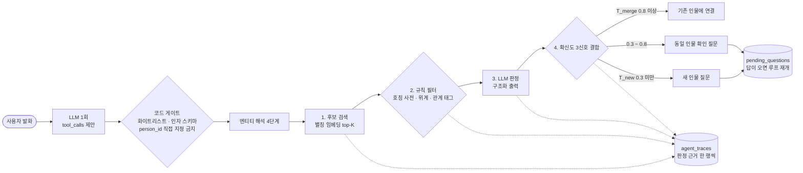
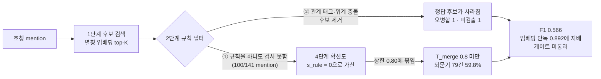
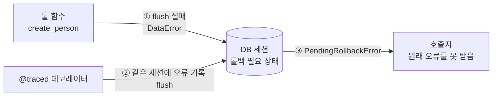
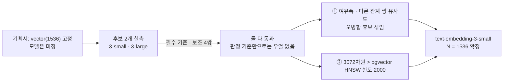
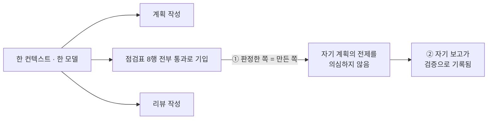

# 관계 메모리 에이전트

대화에서 바뀌는 호칭을 같은 사람으로 묶고, 확신이 모자라면 자동으로 합치지 않고 사용자에게 되묻는 에이전트입니다.

[](https://github.com/SunWoo1213/Relationship/actions/workflows/tests.yml)

## 개요

| 항목 | 내용 |
| --- | --- |
| 기간 | 2026.09 ~ 진행 중 (캡스톤디자인 2) |
| 인원과 역할 | 1인 개발. 설계, 구현, 평가를 모두 맡음 |
| 상태 | 진행 중. 엔티티 해석과 파일럿 평가, 에이전트 루프까지 구현했고 화면과 배포는 아직 없음 |
| 핵심 기술 | Python 3.13 · FastAPI · PostgreSQL 16 + pgvector · OpenAI 임베딩과 구조화 출력 · pytest + GitHub Actions |

사용자가 평소처럼 대화하면 에이전트가 인물과 사건, 일정을 뽑아 장기 메모리를 쌓고, 만남 직전에 필요한 맥락을 요약해 주는 것이 목표입니다.

한국어 대화는 같은 사람을 "팀장 → 김팀장 → 그 사람 → 부장님(승진 후)"처럼 부릅니다. 이 호칭들을 한 인물로 묶는 엔티티 해석이 전체 품질을 좌우합니다. 여기서 두 종류의 실패는 무게가 다릅니다. 잘못 합치면(오병합) 사용자가 보는 메모리가 오염돼 신뢰가 바로 무너지고, 못 묶으면(미검출) 메모리가 흩어질 뿐입니다. 그래서 **오병합이 미검출보다 나쁘다**는 전제로 설계했고, LLM 한 번에 맡기지 않고 단계를 나눠 기준에 못 미치면 묻게 했습니다.

이 프로젝트는 "묻는다"를 예외 처리로 두지 않고 에이전트가 고를 수 있는 행동으로 둡니다. `ask_user`를 별도 툴로 만들고, 되묻기로 끝난 턴은 대기 질문으로 저장해 답이 오면 이어서 재개합니다.

| 단계 | 내용 | 상태 |
| --- | --- | --- |
| P1 ~ P3 | 스키마, 툴 7종, 엔티티 해석 4단계, 베이스라인, 파일럿 데이터셋 | 완료 |
| P4 · P4b | 파일럿 평가 → 실패 분석 → 확신도 재설계 후 게이트 통과 | 완료 |
| P5 | 에이전트 루프(`POST /chat`)와 되묻기 재개(`POST /answers/{id}`) | 완료, 실제 LLM 연결 왕복 확인은 남음 |
| P6 이후 | 메모리 승격, 반복 패턴 감지, 브리핑, 화면, 배포 | 예정 |

## 아키텍처


```mermaid
flowchart LR
    U(["사용자 발화"]) --> L["LLM 1회<br/>tool_calls 제안"]
    L --> GATE{"코드 게이트<br/>화이트리스트 · 인자 스키마<br/>person_id 직접 지정 금지"}
    GATE --> ER["엔티티 해석 4단계"]
    ER --> T1["1. 후보 검색<br/>별칭 임베딩 top-K"]
    T1 --> T2{"2. 규칙 필터<br/>호칭 사전 · 위계 · 관계 태그"}
    T2 --> T3["3. LLM 판정<br/>구조화 출력"]
    T3 --> T4{"4. 확신도 3신호 결합"}
    T4 -->|"T_merge 0.8 이상"| MERGE["기존 인물에 연결"]
    T4 -->|"0.3 ~ 0.8"| ASK["동일 인물 확인 질문"]
    T4 -->|"T_new 0.3 미만"| NEW["새 인물 질문"]
    ASK & NEW --> PQ[("pending_questions<br/>답이 오면 루프 재개")]
    T1 & T2 & T3 & T4 -.-> TR[("agent_traces<br/>판정 근거 한 행씩")]
```

- **확신도**: `0.5·s_llm + 0.3·s_emb + 0.2·s_rule`. `s_llm`은 구조화 출력의 자기보고 점수이고, 규칙을 하나도 검사하지 못하면 `s_rule`을 분모에서 뺍니다(사례 1). 2단계는 관계 태그·위계 충돌 후보를 제거하지 않고 감점하며, 감점된 후보가 선택되면 자동 병합 대신 되묻습니다(승진 인접 위계 완화를 통과한 경우는 예외).
- **데이터 모델**: `persons`, `person_aliases`(별칭 단위 임베딩), `person_facts`, `fact_sources`, `events`, `schedules`, `pending_questions`, `push_subscriptions`, `agent_traces` 9개 테이블입니다.
- **에이전트 루프**: LLM이 제안한 툴 호출을 코드가 화이트리스트 · 인자 스키마 · `person_id` 직접 지정 금지로 거른 뒤 실행합니다. 되묻기로 끝난 턴은 `pending_questions`에 저장되고 `POST /answers/{id}`로 재개됩니다.

## 기술 스택

| 구분 | 기술 | 선택한 이유 |
| --- | --- | --- |
| 언어 · 프레임워크 | Python 3.13, FastAPI, SQLAlchemy 2.0, Alembic | |
| 데이터베이스 | PostgreSQL 16 + pgvector | 별칭 임베딩과 관계 데이터를 한 트랜잭션에서 다루려고 별도 벡터 DB를 두지 않았습니다 |
| 임베딩 | OpenAI `text-embedding-3-small` (1536차원) | 후보 모델을 실측 비교해 인덱스 차원 한도와 오병합 회피를 기준으로 골랐습니다(사례 3) |
| 판정 | OpenAI `gpt-4o-mini` | 판정기는 `anthropic` · `openai` · `gemini` 등록표에서 교체할 수 있게 하고 기본값만 지정했습니다 |
| 테스트 · CI | pytest, GitHub Actions, Docker Compose | 판정 로직과 DB 제약은 스텁이 아니라 실제 PostgreSQL에서 검사해야 했습니다 |
| 개발 도구 | Claude Code (서브에이전트 · 훅 10개) | |

## 문제 해결 사례

1. [실패 케이스 분석으로 확신도 결합식을 고쳐 단순 베이스라인에 밀리던 문제 해결](#1-실패-케이스-분석으로-확신도-결합식을-고쳐-단순-베이스라인에-밀리던-문제-해결)
2. [툴 호출 기록 코드가 원래 DB 오류를 가리던 문제를 SAVEPOINT로 격리해 해결](#2-툴-호출-기록-코드가-원래-db-오류를-가리던-문제를-savepoint로-격리해-해결)
3. [임베딩 모델과 차원을 인덱스 한도와 오병합 위험 기준으로 실측해 결정](#3-임베딩-모델과-차원을-인덱스-한도와-오병합-위험-기준으로-실측해-결정)
4. [AI 코딩 에이전트의 후한 자기 검토를 역할과 모델 분리로 해결](#4-ai-코딩-에이전트의-후한-자기-검토를-역할과-모델-분리로-해결)

### 1. 실패 케이스 분석으로 확신도 결합식을 고쳐 단순 베이스라인에 밀리던 문제 해결

**문제 흐름**


```mermaid
flowchart LR
  M["호칭 mention"] --> S1["1단계 후보 검색<br/>별칭 임베딩 top-K"]
  S1 --> S2{"2단계 규칙 필터"}
  S2 -->|"② 관계 태그·위계 충돌<br/>후보 제거"| X["정답 후보가 사라짐<br/>오병합 1 · 미검출 1"]
  S2 -->|"① 규칙을 하나도 검사 못함<br/>(100/141 mention)"| S4["4단계 확신도<br/>s_rule = 0으로 가산"]
  S4 -->|"상한 0.80에 묶임"| D["T_merge 0.8 미만<br/>되묻기 79건 59.8%"]
  X & D --> G["F1 0.566<br/>임베딩 단독 0.892에 지배<br/>게이트 미통과"]
```

**문제 원인**
- 배경: 제안 방식과 베이스라인 4종을 같은 함수 · 같은 인자로 호출해 시나리오 40건(채점 132 mention)에 같은 지표를 적용하는 평가 게이트를 미리 정함
- 첫 실행에서 제안 방식이 F1 0.566으로 임베딩 단독(0.892)에 오병합 · 미검출 두 축 모두 밀려 게이트 미통과
- 판정식과 데이터셋은 그대로 두고 원시 판정 7,050행을 단계별로 추적해, LLM 과신과 후보 누락 가설을 반증한 뒤 원인 두 가지로 좁힘
- ① 규칙을 하나도 검사하지 못한 mention(141건 중 100건)에도 `s_rule`을 0점으로 더해 확신도 상한이 0.80에 묶임. 되묻기 79건 중 61건은 이미 정답 인물을 고른 상태였음
- ② 2단계 규칙 필터가 관계 태그 · 위계 충돌로 정답 후보를 지워 오병합 1건, 미검출 1건 발생

**해결 과정**
- 게이트 판정식, 임계치 두 개, 가중치 비율, 데이터셋은 그대로 둠. 기준에 못 미쳤다고 기준을 바꾸면 평가가 의미를 잃기 때문
- ① 규칙을 검사하지 못했으면 `s_rule`을 분모에서 빼고 관측된 신호만 재정규화(D12)
- ② 충돌 후보를 지우지 않고 `s_rule` 감점으로 바꿈(D13). 감점된 후보가 선택되면 자동 병합 대신 되묻는 보수 분기 추가

**테스트**
- 환경: OpenAI `gpt-4o-mini-2024-07-18`, `text-embedding-3-small` 실제 호출, 5방식 × 임계치 10점 = 7,050행, 두 실행의 데이터셋 해시 동일 확인
- 저장된 신호로 D12만 적용한 반사실 계산을 먼저 한 뒤, 같은 40건을 조건을 바꾸지 않고 다시 실행해 첫 실행 분석 문서를 기준선으로 비교

> ✅ **결과** 오병합 1 → 0, 미검출 1 → 0, 되묻기 59.8% → 23.5%, F1 0.566 → 0.897로 파일럿 게이트 통과
>
> **배운 점** 측정하지 못한 신호는 0점으로 더하지 말고 결합식에서 빼야 함

---

### 2. 툴 호출 기록 코드가 원래 DB 오류를 가리던 문제를 SAVEPOINT로 격리해 해결

**문제 흐름**


```mermaid
flowchart LR
  T["툴 함수<br/>create_person"] -->|"① flush 실패<br/>DataError"| S[("DB 세션<br/>롤백 필요 상태")]
  D["@traced 데코레이터"] -->|"② 같은 세션에 오류 기록 flush"| S
  S -->|"③ PendingRollbackError"| C["호출자<br/>원래 오류를 못 받음"]
```

**문제 원인**
- 배경: 에이전트의 모든 툴 호출은 `@traced` 데코레이터가 `agent_traces` 테이블에 기록(실패하면 오류도 기록)
- 검증 단계에서 일부러 잘못된 크기(1535차원)의 임베딩을 넣어 보니, 호출자에게 원래 오류인 DataError 대신 PendingRollbackError가 전달되고 오류 기록도 남지 않음
- SQLAlchemy 2.0은 flush가 실패하면 세션을 "롤백 필요" 상태로 두는데, 데코레이터가 같은 세션에서 오류 기록을 다시 flush하면서 새 예외가 원래 예외를 덮어씀

**해결 과정**
- 오류 기록은 `session.begin_nested()`(SAVEPOINT) 안에서만 시도하고, 실패하면 기록을 포기한 채 원래 예외를 그대로 다시 발생시킴
- `session.rollback()`은 호출자가 아직 커밋하지 않은 정상 작업까지 되돌리므로 사용하지 않음

**테스트**
- 환경: 로컬 Docker PostgreSQL 16 + pgvector, 실제 DB로 pytest 실행
- 수정 전: 확인용 스크립트로 호출자가 받는 예외가 PendingRollbackError(원인: DataError: expected 1536 dimensions, not 1535)임을 확인
- 수정 후: flush가 실패하면 호출자가 원래 오류를 받는지 검증하는 재현 테스트 추가, 당시 전체 208개 테스트 통과

> ✅ **결과** 호출자가 원래 DataError를 그대로 받게 됨
>
> **배운 점** 관측을 위한 코드가 본래 동작을 바꾸면 안 됨

---

### 3. 임베딩 모델과 차원을 인덱스 한도와 오병합 위험 기준으로 실측해 결정

**문제 흐름**


```mermaid
flowchart LR
  Q["기획서: vector(1536) 고정<br/>모델은 미정"] --> C["후보 2개 실측<br/>3-small · 3-large"]
  C -->|"필수 기준 · 보조 4쌍"| T["둘 다 통과<br/>판정 기준만으로는 우열 없음"]
  T --> M["① 여유폭 · 다른 관계 쌍 유사도<br/>오병합 후보 섞임"]
  T --> I["② 3072차원 > pgvector HNSW 한도 2000"]
  M & I --> D["text-embedding-3-small<br/>N = 1536 확정"]
```

**문제 원인**
- 배경: 후보 검색은 별칭 단위 임베딩을 pgvector에 저장해 찾음
- 기획서가 스키마를 `vector(1536)`으로 고정해 두고 임베딩 모델은 정하지 않음. 차원은 모델이 정하므로 순서가 거꾸로였음
- 판정 LLM으로 쓰려던 Claude API에는 임베딩 엔드포인트가 없어, 공급자부터 정해야 스키마 차원을 확정할 수 있었음

**해결 과정**
- 결과를 보고 기준을 맞추지 않도록 측정 전에 판정 기준부터 고정: 필수 "팀장↔부장님 > 팀장↔이모", 보조 4쌍
- 호칭 30개를 `text-embedding-3-small`(1536차원)과 `text-embedding-3-large`(3072차원)로 임베딩해 30×30 코사인 유사도 행렬을 만들었고, 두 모델 모두 기준 통과
- ① small이 필수 기준 여유폭이 더 크고(+0.272 vs +0.190) 다른 관계 쌍 유사도가 낮아(팀장↔이모 0.257 vs 0.342) 오병합 회피에 유리. ② large의 3072차원은 pgvector HNSW 인덱스 한도 2000차원을 넘음
- 공급자 교체 비용을 줄이려고 임베딩 호출은 `EmbeddingProvider` 인터페이스 뒤에 둠

**테스트**
- 환경: `scripts/embed_pilot.py`로 OpenAI 임베딩 API를 실제 호출해 1회 실행
- 결정을 위한 파일럿이라 실행 출력과 유사도 행렬 원본(JSON)을 저장해 근거로 남김

> ✅ **결과** `text-embedding-3-small`, 1536차원으로 확정해 `person_aliases.embedding vector(1536)`에 반영
>
> **배운 점** 후보가 모두 기준을 통과할 때는 프로젝트의 우선순위(오병합 회피)와 인프라 제약(인덱스 차원 한도)으로 가르는 것이 설명 가능한 선택

---

### 4. AI 코딩 에이전트의 후한 자기 검토를 역할과 모델 분리로 해결

**문제 흐름**


```mermaid
flowchart LR
  A["한 컨텍스트 · 한 모델"] --> P["계획 작성"]
  A --> V["점검표 8행 전부 통과로 기입"]
  A --> R["리뷰 작성"]
  V -->|"① 판정한 쪽 = 만든 쪽"| B["자기 계획의 전제를<br/>의심하지 않음"]
  B --> F["② 자기 보고가<br/>검증으로 기록됨"]
```

**문제 원인**
- 배경: Claude Code로 개발하며 작업 단위마다 계획 → 계획 검증 → 구현 → 구현 검토 순서를 문서로 남김
- 첫 작업 단위에서는 한 컨텍스트, 한 모델이 계획을 쓰고 같은 자리에서 계획 검증 점검표 8행을 전부 "통과"로 채운 뒤 검토 문서까지 씀
- ① 만든 쪽이 판정까지 해 자기 계획의 전제를 의심하지 않음
- ② 검증 스크립트가 "증거를 붙였는가"는 강제했지만 "누가 판정하는가"는 강제하지 않아, 통과 표시가 사실상 자기 보고였음

**해결 과정**
- ① 단계마다 다른 에이전트와 모델 배치: 계획 architect(Opus), 구현 backend-agent(Sonnet), 평가 데이터 eval-agent(Opus), 검증 verifier(Fable). verifier는 항상 새 컨텍스트에서 시작
- ② `verify-plan.sh`, `verify-impl.sh`가 `검증자:`, `검토자:` 줄에 verifier가 없으면 FAIL을 내도록 규칙을 스크립트로 강제
- 지적은 소견 번호(`F-xxxxxx`)로 남겨 원인 분석, 해결 단계, 재검증 명령까지 한 항목에서 추적

**테스트**
- 환경: 개발 절차 변경이라 매 작업 단위의 검증 스크립트가 verifier 기록 유무를 검사
- verifier는 명령 출력과 커밋 해시를 증거 파일로 제출

> ✅ **결과** 분리 이후 verifier가 원래 DB 오류가 가려지는 문제(사례 2), DB 접속 정보 `repr`의 비밀번호 노출, "아니요"로 답해도 새 인물이 만들어지는 문제를 찾아 수정
>
> **배운 점** 역할 분리는 문서 규칙만으로는 지켜지지 않아 검증 스크립트가 FAIL을 내게 해야 함

## 역할과 기여도

1인 프로젝트로 설계와 구현, 평가를 모두 직접 했습니다. Claude Code 서브에이전트로 개발하되 계획과 커밋, 푸시는 단계마다 직접 승인했습니다.

- 스키마 9테이블을 설계하고 별칭 단위 임베딩을 pgvector로 저장하게 했습니다.
- 툴 7종을 만들었습니다. `search_person`, `create_person`, `update_person`, `add_event`, `add_schedule`, `get_briefing`, `ask_user`이고, 새 인물 생성은 사용자가 긍정 선택지로 답했을 때만 허용합니다.
- 엔티티 해석 4단계와 확신도 결합식, 임계치 2개를 설계하고 구현했습니다.
- 에이전트 루프를 만들었습니다. LLM이 제안한 툴 호출을 코드가 걸러 실행하고, 되묻기로 끝난 턴을 비동기로 재개합니다.
- 평가 장치를 만들었습니다. 제안 방식과 베이스라인 4종을 같은 함수 · 같은 인자로 호출해 시나리오 40건에 같은 지표를 적용합니다.
- 모든 판정의 후보와 확신도 분해, 툴 호출, 토큰을 `agent_traces`에 남겨 원시 판정 파일 하나로 지표를 다시 계산할 수 있게 했습니다.

## 개발 방식

Claude Code로 개발하며, 에이전트가 기획서 의도에서 벗어나지 않도록 절차를 훅으로 강제합니다. 기획서를 먼저 검증해 문제(R) → 결정(D) → 명세(S) → 작업 패키지(P) → 커밋으로 이어 붙였기 때문에, 커밋마다 왜 생겼는지 거꾸로 추적할 수 있습니다.

- 계획과 구현, 검증을 다른 모델이 맡고 계획 · 커밋 · 푸시 · main 승격은 사람이 승인합니다(사례 4).
- 훅 10개가 승인 없는 커밋과 푸시, `.env`와 키 파일 쓰기, 강제 푸시와 이력 파괴, 승인 없는 에이전트 위임을 막고, 인수인계 문서가 코드보다 오래되면 세션 종료를 막습니다.
- git pre-commit 훅이 비밀 파일과 비밀 문자열, 5MB 초과 파일의 커밋을 git 단계에서 막습니다.

## 실행 방법

```bash
cp .env.example .env          # 키 이름만 적힌 템플릿, .env 는 git 제외
pip install -r requirements-dev.txt

docker compose up -d          # PostgreSQL 16 + pgvector
python -m alembic upgrade head

python -m pytest -q tests/    # 네트워크 불필요, LLM · 임베딩은 스텁
```

테스트는 `relationship_test` DB를 씁니다. 없으면 pytest가 스스로 만들고 마이그레이션합니다. 백엔드 실행, 채팅 API 호출, 평가 재현 방법은 [`docs/RUNNING.md`](docs/RUNNING.md)에 있습니다.

## 문서

| 알고 싶은 것 | 보는 곳 |
| --- | --- |
| 왜 이렇게 설계했나 | `docs/wiki/decisions/` |
| 스키마 · 툴 · 해석 파이프라인 · 평가 명세 | `docs/wiki/specs/` |
| 평가 결과 · 실패 케이스 분석 | `reports/eval.md` · `reports/failure_cases.md` · `reports/metrics.json` |
| 평가 데이터셋 | `data/scenarios/` (라벨 규칙 `schema.json`) |
| 기획서 검증 · 임베딩 파일럿 | `docs/proposal-review.md` · `reports/embed_pilot.md` |
| 절차와 교훈 | `docs/wiki/INDEX.md` · `docs/wiki/lessons/` |

MIT — [LICENSE](LICENSE)
